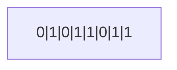

# C program: a modern approach Ch.11 note

# Program overview


| 題號  | 功能               | 觀念          | 連結                 |
| --- | ---------------- | ----------- | ------------------ |
| 範例一 | 挑出 10 個數字中的最大最小值 | 運用指標修改變數的數值 | [view](./maxmin.c) |


## I. Pointer Vairiables

#### 一，Intro 

- bytes: 主記憶體由多個 bytes 所組成，而 1 byte 又等於 8 個 bits（用於儲存 0 或 1）<br>示意圖：

- 因為主記憶體有許多的 byte 所組成，所以每一個 byte 自然會需要一個**位置的編號 (address)** 來讓我們可以找到它，而位址與陣列一樣都是從 **0 開始數到 n - 1**<br>以下為示意圖
	- 
- 如果一個變數佔據了多個位置，就會以最前面的位置來作為變數位置的代號<br>E.g: i 的位置代號為 2000
	- 
- pointer variable (指標變數)： 用以**儲存變數的位置**。僅僅只有存下位置，而沒有存下值 (像是電腦的中的 inode 之於 block)
- 假設 p 為 pointer variable 而 i 為 variable。若 p 儲存下了 i 的位置，則我們稱 p 指向 i
	```mermaid
	graph LR;
	    p["p"];
	    i["i"];
	    p --> i;
	```
<br><br>

#### 二，Declaring Pointer Variables

- 與一般變數的宣告方式相同，**但要在變數前面加上一個\***<br>E.g:
	```c
	int *p
	```
	宣告 p 為**指向 int 型別的 object (物件)** 的 pointer variable
	- *補：為何會用 object (物件會在 ch 17 才講到)*
- pointer variable 也可以和同樣行別的變數一起宣告
	```c
	int i, j, a[10], b[20], *p, *q;
	```
- 它只能夠指向被宣告的型別的物件 (**稱為 referenced type**)<Br>E.g:
	```c
	int *p;     // points only to integers
	double *q;  // points only to doubles
	char *r;    // points only to characters
	```
<br><BR>

## II. The Address and Indirection Operators

#### 一，The Address Operator

- `&` (address operator) ： 用於指出某個變數的位置<br>E.g:
	```c
	&x  // 此為 x 這個變數的位置
	```
- 初始化 pointer variable: 
	1. 用一個 lvalue，且要記得加上代表變數位置的 `&`
		```c
		int i, *p;
		...
		p = &i;
		// p 指向 i
		```
	2. 在宣告時就初始化：<br>E.g:
		```c
		int i;
		int *p = &i
		```
<br>

#### 二， The Indirection Operator

- \* (indirection operator)：如果 p 為 pointer variable，則 `*p` 為顯示 p 所指向的物件的 i 所儲存的**值**<br>E.g: 顯示 i 的值 （**不是** i 的位址）
	```c
	printf("%d\n", *p);
	```
- 只要 p 指向了 i ，則 \*p 就是 i 的化名，所以只要**改變了 \*p 就會改變 i**<br>E.g:
	1. 
		```c
		p = &i;
		```
		```mermaid
		graph LR;
		  P["p"];
		  I["? (variable i)"];
		  P --> I;
		```
	2. 
		```c
		i = 1;
		printf("%d\n", i);   // prints 1
		printf("%d\n", *p);  // prints 1
		```
		```mermaid
		graph LR;
		  P["p"];
		  I["1 (variable i)"];
		  P --> I;
		```
	3. 
		```c
		*p = 2;
		printf("%d\n", i);   // prints 2
		printf("%d\n", *p);  // prints 2
		```
		```mermaid
		graph LR;
		  P["p"];
		  I["2 (variable i)"];
		  P --> I;
		```
- **注意**
	1. 如果直接對未初始化的 pointer variable 使用 indirection operator ，會導致 undefined behavior
	2. 不可以直接指派 pointer variable 為一個數字，因為如果 p 真的包含一個有效的位址，則它會**直接修改那個位址**
<BR><BR>

## III. Pointer Assignment

#### 一，Intro

- 初始化的方式：
	- 假設 i, j, p, q 被宣告如下：
		```c
		int i, j, *p, *q;
		```
	1. 
		```c
		p = &i;
		```
	2. 
		```c
		q = p;
		```
		這個是直接將 **p (i 的位址) 複製給 q**，示意圖如下
		```mermaid
		graph LR;
		  p["p"];
		  q["q"];
		  i["? (object i)"];
		  p --> i;
		  q --> i;
		```
- 因為 p 與 q 都指向 i ，所以改變 i 的時候 \*p 與 \*q 都會一起改變
<br><br>

## IV. Pointers as Auguments

#### 一，Intro

- 將指標作為引數就可以**改變原本變數的值**，從而解除原本引數不能夠修改值的限制
- 接下來會用分解小數與整數的 function 來作為示範
	- program
		1. function:
			```c
			void decompose(double x, long *int_part, double *frac_part)
			{
			  *int_part = (long) x
			  *frac_part = x - *int_part;
			}
			```
		2. prototype:
			```c
			void decompose(double x, long *int_part, double *frac_part)
			```
		3. 呼叫 decompose:
			```c
			decompose(3.14159265358, &i, &d);
			```
			- 將 int_part 指向 i
			
	- 示意圖：
		1.  因為我們呼叫的時候 i 與 d 皆有 `&` ，所以 decompose 的引數就會是 i 與 d 的 pointer 。接著 3.14159265358 會先被複製進 x ，而 i 的指標會被儲存進 int_part，d的指標會被儲存進 frac_part
			```mermaid
			graph LR;
			  x["3.14159265358 (variable x)"];
			  int_node["int_part"];
			  frac_node["frac_part"];
			  i["? (variable i)"];
			  d["? (variable d)"];
			  int_node --> i;
			  frac_node --> d;
			```
		2. ```c
		   *int_part = (long) x
		   ```
		   這行 statement 則會將 3 儲存進 \*int_part （也就是 i） 中 
			```mermaid
			graph LR;
			  x["3.14159265358 (variable x)"];
			  int_node["int_part"];
			  frac_node["frac_part"];
			  i["3 (variable i)"];
			  d["? (variable d)"];
			  int_node --> i;
			  frac_node --> d;
			```
		3. 
			```c
			*frac_part = x - *int_part;
			```
			這行 statement 則會把 3.14159265358 的小數部份給存進 \*frac_part (也就是 d)
			```mermaid
			graph LR;
			  x["3.14159265358 (variable x)"];
			  int_node["int_part"];
			  frac_node["frac_part"];
			  i["3 (variable i)"];
			  d[".14159265358 (variable d)"];
			  int_node --> i;
			  frac_node --> d;
			```
- 而在 `scanf` 中的 `&` 也是將 pointer 用作 argument 的一種。
- 雖然 `scanf` 的引數一定要是指標，但並不一定要有 `&`<br>E.g:
	```c
	int i, *p;
	...
	p = &i;
	scanf("%d", p);
	```
	因為 p 本來就是 i 的位址，所以 `scanf` 將會讀取這個整數並存進去 i
	```c
	scanf("%d", &p);  // WRONG
	```
	`scanf` 會將整數儲存進 p 而非 i
<br>

#### 二，範例一：Finding the Largest and Smallest Elements in an Array

- 學習重點：
	- 
		```c
		max = &a[0];
		*max = a[0];
		```
		- 這兩個的寫法都是合法的，但兩者的用意不同。 
		- `max = &a[0]` 是讓指標轉向，轉而去指向 a\[0]
		- `*max = a[0]` 則是修改 max 所指向的物件的值，在以下也就是修改 big 的值
- program:
	```c
	// Finds the largest and smallest elements in an array
	
	#include <stdio.h>
	
	#define N 10
	
	// prtotype
	void max_min(int a[], int n, int *max, int *min);
	
	int main(void) {
	  int b[N], big, small;
	
	  printf("Enter 10 nubers: ");
	  for (int i = 0; i < N; i++) {
	    scanf("%d", &b[i]);
	  }
	
	  max_min(b, N, &big, &small);
	
	  printf("Largest: %d\n", big);
	  printf("Smallest: %d\n", small);
	
	  return 0;
	}
	
	void max_min(int a[], int n, int *max, int *min) {
	  *max = a[0];
	  *min = a[0];
	
	  for (int i = 1; i < n; i++) {
	    if (a[i] > *max) {
	      *max = a[i];
	    }
	    if (a[i] < *min) {
	      *min = a[i];
	    }
	  }
	}
	```
<br>