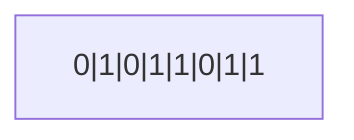
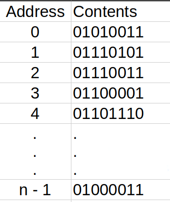
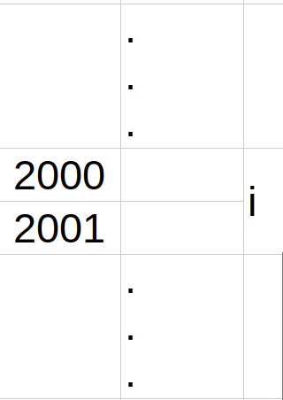

# C program: a modern approach Ch.11 note

# Program overview


| 題號     | 功能                 | 觀念                   | 連結                 |
| ------ | ------------------ | -------------------- | ------------------ |
| 範例一    | 挑出 10 個數字中的最大最小值   | 運用指標修改變數的數值          | [view](./maxmin.c) |
| Proj.4 | 輸入五張撲克牌的花色與點數後判斷牌型 | 將全域變數修改為引數，並運用指標來修改值 | [vies](./poker2.c) |
<br><Br>

---
## I. Pointer Vairiables

#### 一，Intro 

- bytes: 主記憶體由多個 bytes 所組成，而 1 byte 又等於 8 個 bits（用於儲存 0 或 1）<br>示意圖：

- 因為主記憶體有許多的 byte 所組成，所以每一個 byte 自然會需要一個**位置的編號 (address)** 來讓我們可以找到它，而位址與陣列一樣都是從 **0 開始數到 n - 1**<br>以下為示意圖
	- 
- 如果一個變數佔據了多個位置，就會以最前面的位置來作為變數位置的代號<br>E.g: i 的位置代號為 2000
	- 
- pointer variable (指標變數)： 用以**儲存變數的位置**。僅僅只有存下位置，而沒有存下值 (像是電腦的中的 inode 之於 block)
- 假設 p 為 pointer variable 而 i 為 variable。若 p 儲存下了 i 的位置，則我們稱 p 指向 i
	```mermaid
	graph LR;
	    p["p"];
	    i["i"];
	    p --> i;
	```
<br><br>

#### 二，Declaring Pointer Variables

- 與一般變數的宣告方式相同，**但要在變數前面加上一個\***<br>E.g:
	```c
	int *p
	```
	宣告 p 為**指向 int 型別的 object (物件)** 的 pointer variable
	- *補：為何會用 object (物件會在 ch 17 才講到)*
- pointer variable 也可以和同樣行別的變數一起宣告
	```c
	int i, j, a[10], b[20], *p, *q;
	```
- 它只能夠指向被宣告的型別的物件 (**稱為 referenced type**)<Br>E.g:
	```c
	int *p;     // points only to integers
	double *q;  // points only to doubles
	char *r;    // points only to characters
	```
<br><BR>

## II. The Address and Indirection Operators

#### 一，The Address Operator

- `&` (address operator) ： 用於指出某個變數的位置<br>E.g:
	```c
	&x  // 此為 x 這個變數的位置
	```
- 初始化 pointer variable: 
	1. 用一個 lvalue，且要記得加上代表變數位置的 `&`
		```c
		int i, *p;
		...
		p = &i;
		// p 指向 i
		```
	2. 在宣告時就初始化：<br>E.g:
		```c
		int i;
		int *p = &i
		```
<br>

#### 二， The Indirection Operator

- \* (indirection operator)：如果 p 為 pointer variable，則 `*p` 為顯示 p 所指向的物件的 i 所儲存的**值**<br>E.g: 顯示 i 的值 （**不是** i 的位址）
	```c
	printf("%d\n", *p);
	```
- 只要 p 指向了 i ，則 \*p 就是 i 的化名，所以只要**改變了 \*p 就會改變 i**<br>E.g:
	1. 
		```c
		p = &i;
		```
		
		```mermaid
		graph LR;
		  P["p"];
		  I["? (variable i)"];
		  P --> I;
		```
	2. 
		```c
		i = 1;
		printf("%d\n", i);   // prints 1
		printf("%d\n", *p);  // prints 1
		```
		```mermaid
		graph LR;
		  P["p"];
		  I["1 (variable i)"];
		  P --> I;
		```
	3. 
		```c
		*p = 2;
		printf("%d\n", i);   // prints 2
		printf("%d\n", *p);  // prints 2
		```
		```mermaid
		graph LR;
		  P["p"];
		  I["2 (variable i)"];
		  P --> I;
		```
- **注意**
	1. 如果直接對未初始化的 pointer variable 使用 indirection operator ，會導致 undefined behavior
	2. 不可以直接指派 pointer variable 為一個數字，因為如果 p 真的包含一個有效的位址，則它會**直接修改那個位址**
<BR><BR>

## III. Pointer Assignment

#### 一，Intro

- 初始化的方式：
	- 假設 i, j, p, q 被宣告如下：
		```c
		int i, j, *p, *q;
		```
	1. 
		```c
		p = &i;
		```
	2. 
		```c
		q = p;
		```
		這個是直接將 **p (i 的位址) 複製給 q**，示意圖如下
		```mermaid
		graph LR;
		  p["p"];
		  q["q"];
		  i["? (object i)"];
		  p --> i;
		  q --> i;
		```
- 因為 p 與 q 都指向 i ，所以改變 i 的時候 \*p 與 \*q 都會一起改變
<br><br>

## IV. Pointers as Auguments

#### 一，Intro

- 將指標作為引數就可以**改變原本變數的值**，從而解除原本引數不能夠修改值的限制
- 接下來會用分解小數與整數的 function 來作為示範
	- program
		1. function:
			```c
			void decompose(double x, long *int_part, double *frac_part)
			{
			  *int_part = (long) x
			  *frac_part = x - *int_part;
			}
			```
		2. prototype:
			```c
			void decompose(double x, long *int_part, double *frac_part)
			```
		3. 呼叫 decompose:
			```c
			decompose(3.14159265358, &i, &d);
			```
			- 將 int_part 指向 i
			
	- 示意圖：
		1.  因為我們呼叫的時候 i 與 d 皆有 `&` ，所以 decompose 的引數就會是 i 與 d 的 pointer 。接著 3.14159265358 會先被複製進 x ，而 i 的指標會被儲存進 int_part，d的指標會被儲存進 frac_part
			```mermaid
			graph LR;
			  x["3.14159265358 (variable x)"];
			  int_node["int_part"];
			  frac_node["frac_part"];
			  i["? (variable i)"];
			  d["? (variable d)"];
			  int_node --> i;
			  frac_node --> d;
			```
		2. ```c
		   *int_part = (long) x
		   ```
		   這行 statement 則會將 3 儲存進 \*int_part （也就是 i） 中 
			```mermaid
			graph LR;
			  x["3.14159265358 (variable x)"];
			  int_node["int_part"];
			  frac_node["frac_part"];
			  i["3 (variable i)"];
			  d["? (variable d)"];
			  int_node --> i;
			  frac_node --> d;
			```
		3. 
			```c
			*frac_part = x - *int_part;
			```
			這行 statement 則會把 3.14159265358 的小數部份給存進 \*frac_part (也就是 d)
			```mermaid
			graph LR;
			  x["3.14159265358 (variable x)"];
			  int_node["int_part"];
			  frac_node["frac_part"];
			  i["3 (variable i)"];
			  d[".14159265358 (variable d)"];
			  int_node --> i;
			  frac_node --> d;
			```
- 而在 `scanf` 中的 `&` 也是將 pointer 用作 argument 的一種。
- 雖然 `scanf` 的引數一定要是指標，但並不一定要有 `&`<br>E.g:
	```c
	int i, *p;
	...
	p = &i;
	scanf("%d", p);
	```
	因為 p 本來就是 i 的位址，所以 `scanf` 將會讀取這個整數並存進去 i
	```c
	scanf("%d", &p);  // WRONG
	```
	`scanf` 會將整數儲存進 p 而非 i
<br>

#### 二，範例一：Finding the Largest and Smallest Elements in an Array

- 學習重點：
	- 
		```c
		max = &a[0];
		*max = a[0];
		```
		- 這兩個的寫法都是合法的，但兩者的用意不同。 
		- `max = &a[0]` 是讓指標轉向，轉而去指向 a\[0]
		- `*max = a[0]` 則是修改 max 所指向的物件的值，在以下也就是修改 big 的值
- program:
	```c
	// Finds the largest and smallest elements in an array
	
	#include <stdio.h>
	
	#define N 10
	
	// prtotype
	void max_min(int a[], int n, int *max, int *min);
	
	int main(void) {
	  int b[N], big, small;
	
	  printf("Enter 10 nubers: ");
	  for (int i = 0; i < N; i++) {
	    scanf("%d", &b[i]);
	  }
	
	  max_min(b, N, &big, &small);
	
	  printf("Largest: %d\n", big);
	  printf("Smallest: %d\n", small);
	
	  return 0;
	}
	
	void max_min(int a[], int n, int *max, int *min) {
	  *max = a[0];
	  *min = a[0];
	
	  for (int i = 1; i < n; i++) {
	    if (a[i] > *max) {
	      *max = a[i];
	    }
	    if (a[i] < *min) {
	      *min = a[i];
	    }
	  }
	}
	```
<br>

#### 三，Using `const` to Protect Arguments

- 如果將 pointer variable 作為引數，但卻不想改變他的值的話，就用 `const`
- 有時候我們只是需要去利用指標來比較值（因為值可能很大，直接複製會佔用太多的記憶體），所以就不能改變引數<br>E.g:
	```c
	void f(const int *p) {
	 ...
	}
	```
<BR>

#### 四，Pointer as Return Value

- function 也可以指定回傳 pointer<br>E.g\:
	1. function
		```c
		int *max(int *a, int *b) {
		  if (*a > *b)
		    return a;
		    // 因為 a 是 pointer
		    // 所以這裡是回傳參數的位置
		    // (pointer variable 就是儲存位址的變數)
		  else
		    return b;
		}
		```
	2. 呼叫 function
		```c
		int *p, i, j;
		...
		p = max(&i, &j)
		```
- 也可以將指標用於陣列。如果 a 為陣列，則 &a\[i] 為陣列 a 中第 i 個元素的位址<br>E.g:
	```c
	int *find_middle(int a[], int n) {
	  return &a[n/2];
	}
	```
<br><Br>

---
# Exercises

## **Ex.1: 變數的別稱

- 我的答案：
	- (a), (g)
- Reason:
	1. `&` 是指變數的位址，而 `*` 是指所指向的變數的實際值
	2. 所以 `*` 與 `&` 一起用的時候就會抵銷
	3. 但在 (h) 中，\&\*i 會因為 \* 與 \& 皆為 right associativity，所以會**等價於 \&(\*i)** ，而 i 是無法被使用 indirection operator 的，所以**編譯器會報錯**
<br>

## Ex.2: 初始化指標

- 我的答案：
	- (e), (f), (i)
- Reason:
	1. 因為 p 與 q 為指標，所以在初始化的時候要**給予變數的位置**，所以要用 i 來初始化的時候就必須加上代表位址的 \&
	2. 但要用指標來初始化的時候，就不需要加上 \& (因為指標變數本來就是位置)
	3. 而 `*p = *q;` 則是修改 p 與 q 中所指向的物件的值，所以也是合法的
<Br>

## Ex.3: 將 pointer 作為引數之一。修改 function

- 我的答案：
	```c
	void avg_sum(double a[], int n, double *avg, double *sum)
	{
	  int i;
	  
	  *sum = 0.0;
	  for (i = 0; i < n; i++)
	    *sum += a[i];
	  *avg = *sum / n;
	}
	```
- Reason:
	- 要修改實際值的話必須要再指標前加上 \*
	- 如果直接用 `sum = 0.0` 會變成位址為 0.0 進而報錯
<br>

## Ex.4: 將 pointer 作為引數之二。寫出交換數字的 function

- 我的答案：
	```c
	void swap(int *p, int *q) {
	  int temp;
	  
	  temp = *p;
	  *p = *q;
	  *q = temp;
	}
	```
<br>

## Ex.5: 將 pointer 作為引數之三。寫出拆分時間的 function

- 我的答案：
	```c
	void split_time(long total_sec, int *hr, int *min, int *sec)
	{
	  *hr = total_sec / 3600;
	  *min = (total_sec - (*hr * 3600)) / 60;
	  *sec = total_sec % 60;
	}
	```
<br>

## Ex.6: 將 pointer 作為引數，並比較

- 我的答案：
```c
void find_two_largest(int a[], int n, int *largest,
                      int *second_largest)
{
  int temp;
  
  *largest = *second_largest = a[0];
  
  for (int i = 1; i < n; i++)
    if (a[i] > *largest) {
      temp = *largest;
      *largest = a[i];
      *second_largest = temp;
    }
    else if(a[i] > *second_largest) {
      *second_largest = a[i];
    }
```
- 問題：
	- 當開頭是最大的時候， program 就會無法更新數值，所以必須要先**手動比較前兩項的大小**
- 修正後的 program:
```c
void find_two_largest(int a[], int n, int *largest,
                      int *second_largest)
{
  // 先手動比較前兩項的數值大小
  if (a[0] > a[1]) {
    *largest = a[0];
    *second_largest = a[1];
  } else {
    *largest = a[1];
    *second_largest = a[0];
  }
  
  // 比較前兩項以後
  for (int i = 2; i < n; i++)
    if (a[i] > *largest) {
      *second_largest = *largest;
      *largest = a[i];
    }
    else if(a[i] > *second_largest) {
      *second_largest = a[i];
    }
```
<br>

## Ex.7: 運用指標來拆分日期

- 重要觀念：
	1. 如果想要去依序處理一串固定的數字 (例如 31, 28, 31, ...。或是分數級距 90, 80 , 70, ...) ，將**數字放進陣列並比對**
	2. 一月是 31 天，不是 30 天
	3. 除了維護兩個變數以外，也可以直接剪掉並更新 day_of_year
- 我的答案：
```c
void split_date(int day_of_year, int year, 
                int *month, int *day)
{
  int leap_year = 0;

  // 判斷是否為閏年
  if (year % 4 == 0 && year % 100 != 0)
    leap_year = 1;
  else if (year / 100 == 0 && year / 400 == 0)
    leap_year = 1;
    
  if (leap_year) {
    if (day_of_year < 30) {
      *month = 1;
      *day = day_of_year
    } else if (day_of_year < (31 + 29)) {
      *month = 2;
      *day = day_of_year - 30;
    } else if (day_of_year < (30 + 29 + 31)) {
      *month = 3;
      *day = day_of_year - (30 + 29);
    } else if (day_of_year < (30 * 2 + 29 + 31)) {
      *month = 4;
      *day = day_of_year - (30 + 29 + 31);
    } else if (day_of_year < (30 * 2 + 29 + 31 * 2)) {
      *month = 5;
      *day = day_of_year - (30 + 29 + 31 + 30);
    } else if (day_of_year < (30 * 3 + 29 + 31 * 2)) {
      *month = 6;
      *day = day_of_year - (30 + 26 + 31 + 30 + 31);
    } else if (day_of_year < (30 * 3 + 29 + 31 * 3))
      *month = 7;
      *day = day_of_year - (30 * 3 + 29 + 31 * 2)
    } else if (day_of_year < (30 * 3 + 29 + 31 * 4)) {
      *month = 8;
      *day = day_of_year - (30 *3 + 29 + 31 * 3);
    } else if (day_of_year < (30 * 4 + 29 + 31 * 4))
      *month = 9;
      *day = day_of_year - (30 * 3 + 29 + 31 * 4);
    } else if (day_of_year < (30 * 4 + 29 + 31 * 5)) {
      *month = 10;
      *day = day_of_year - (30 * 3 + 29 + 31 * 4));
    } else if (day_of_year < (30 * 5 + 29 + 31 * 5)) {
      *month = 11;
      *day = day_of_year - (30 * 4 + 29 + 31 * 5)
    } else {
      *month = 12;
      *day = day_of_year - (30 * 5 + 29 + 31 * 5)
    }
  } else {
    if (day_of_year < 30) {
      *month = 1;
      *day = day_of_year
    } else if (day_of_year < (30 + 28)) {
      *month = 2;
      *day = day_of_year - 30;
    } else if (day_of_year < (30 + 28 + 31)) {
      *month = 3;
      *day = day_of_year - (30 + 29);
    } else if (day_of_year < (30 * 2 + 28 + 31)) {
      *month = 4;
      *day = day_of_year - (30 + 29 + 31);
    } else if (day_of_year < (30 * 2 + 28 + 31 * 2)) {
      *month = 5;
      *day = day_of_year - (30 + 29 + 31 + 30);
    } else if (day_of_year < (30 * 3 + 28 + 31 * 2)) {
      *month = 6;
      *day = day_of_year - (30 + 26 + 31 + 30 + 31);
    } else if (day_of_year < (30 * 3 + 28 + 31 * 3))
      *month = 7;
      *day = day_of_year - (30 * 3 + 28 + 31 * 2)
    } else if (day_of_year < (30 * 3 + 28 + 31 * 4)) {
      *month = 8;
      *day = day_of_year - (30 *3 + 28 + 31 * 3);
    } else if (day_of_year < (30 * 4 + 28 + 31 * 4))
      *month = 9;
      *day = day_of_year - (30 * 3 + 28 + 31 * 4);
    } else if (day_of_year < (30 * 4 + 28 + 31 * 5)) {
      *month = 10;
      *day = day_of_year - (30 * 3 + 28 + 31 * 4));
    } else if (day_of_year < (30 * 5 + 28 + 31 * 5)) {
      *month = 11;
      *day = day_of_year - (30 * 4 + 28 + 31 * 5)
    } else {
      *month = 12;
      *day = day_of_year - (30 * 5 + 28 + 31 * 5)
  }
}
```

- 修正過後的答案：
```c
void split_date(int day_of_year, int year, 
                int *month, int *day)
{
  int day_of_month[12] = {31, 28, 31, 30, 31, 30, 
                          31, 31, 30, 31, 30, 31};

  if (year % 4 == 0 && year % 100 != 0)
    day_of_month[1] = 29;
  else if (year % 100 == 0 && year % 400 == 0)
    day_of_month[1] = 29;
    
  int check_cum_day = 0, cum_day = 0;
  for (int i = 0; i < 12; i++) {
    check_cum_day += day_of_month[i];
    // 如果「輸入的天數」小於等於「目前累計的天數」，代表就在這個月！
    if (day_of_year <= check_cum_day) {
      *month = i + 1;
      *day = day_of_year - cum_day;
      // 減去「上個月底累積的天數」就是日期
      break;
    }
    cum_day = check_cum_day;
    // 更新「上個月底累積的天數」
  }
}
```
- 更簡潔的寫法
```c
void split_date(int day_of_year, int year, 
                int *month, int *day)
{
  int day_of_month[12] = {31, 28, 31, 30, 31, 30, 
                          31, 31, 30, 31, 30, 31};

  if (year % 4 == 0 && year % 100 != 0)
    day_of_month[1] = 29;
  else if (year % 100 == 0 && year % 400 == 0)
    day_of_month[1] = 29;
    
  for (int i = 0; i < 12; i++) {
    // 如果剩下的天數已經小於等於這個月的天數
    // 代表答案就在這個月
    if (day_of_year <= day_of_month[i]) {
      *month = i + 1;
      *day = day_of_year;
      break;
    }
    // 如果還不夠，就扣掉這個月的天數，繼續往下找
    day_of_year -= day_of_month[i];
}
```
<br>

## Ex.8: 回傳指標

- 我的答案：
	```c
	int *find_largest(int a[], int n)
	{
	  int *largest = &a[0];
	  
	  for(int i = 1; i < n; i++) {
	    if (a[i] > *largest)
	      largest = &a[i];
	  }
	  return largest;
	}
	```
<br><Br>

# Programming project

## Proj.4

- 學習重點：
	1. 因為 \* 的 precedence 比 \++ 還高，所以 \*pairs++ 會變成 \*(pairs++) (先遞增，在取實際值)
	2. 所以如果要遞增他的話就要用 (\*pairs++)
- program:
```c
// Classifies a poker hand

#include <stdbool.h>
#include <stdio.h>
#include <stdlib.h>

#define NO_SUIT 4
#define NO_RANK 13
#define NO_CARD 5

// prototype
void read_cards(int no_in_rank[], int no_in_suit[]);
void analyze_hand(int no_in_rank[], int no_in_suit[],
                  bool* straight, bool* flush, bool* four_of_a_kind,
                  bool* three_of_a_kind, int* pairs);
void print_result(bool* straight, bool* flush, bool* four_of_a_kind,
                  bool* three_of_a_kind, int* pairs);

// main: Calls rea_card, analyze_hand, and print_result
//       repeatedly
int main(void) {
  for (;;) {
    int no_in_rank[NO_RANK] = {0};
    int no_in_suit[NO_SUIT] = {0};
    bool straight, flush, four_of_a_kind, three_of_a_kind;
    int pairs;  // it can be 0, 1, or, 2

    read_cards(no_in_rank, no_in_suit);
    analyze_hand(no_in_rank, no_in_suit, &straight, 
                 &flush, &four_of_a_kind, &three_of_a_kind, 
                 &pairs);
    print_result(&straight, &flush, &four_of_a_kind, 
                 &three_of_a_kind,  &pairs);
  }
}

// read_cards: Reads the cardss into external variables;
//             checks for bad cards and duplicate cards.
void read_cards(int no_in_rank[], int no_in_suit[]) {
  int card_exists[NO_RANK][NO_SUIT] = {false};
  int rank, suit;
  char rank_ch, suit_ch;

  // 修正點：歸零全域變數
  for (int i = 0; i < NO_RANK; i++) {
    no_in_rank[i] = 0;
  }
  for (int i = 0; i < NO_SUIT; i++) {
    no_in_suit[i] = 0;
  }

  int i = 0;
  while (i < NO_CARD) {
    printf("Enter a card: ");

    // 接下來用 switch 將輸入的文字轉換成對應的數字
    // 讀取並轉換 rank
    scanf(" %c", &rank_ch);
    switch (rank_ch) {
      case '0':
        exit(EXIT_SUCCESS);
      case 'a':
      case 'A':
        rank = 0;
        break;
      case '2':
        rank = 1;
        break;
      case '3':
        rank = 2;
        break;
      case '4':
        rank = 3;
        break;
      case '5':
        rank = 4;
        break;
      case '6':
        rank = 5;
        break;
      case '7':
        rank = 6;
        break;
      case '8':
        rank = 7;
        break;
      case '9':
        rank = 8;
        break;
      case 't':
      case 'T':
        rank = 9;
        break;
      case 'j':
      case 'J':
        rank = 10;
        break;
      case 'q':
      case 'Q':
        rank = 11;
        break;
      case 'k':
      case 'K':
        rank = 12;
        break;
      default:
        while (getchar() != '\n');
        printf("Please enter a correct rank\n");
        printf("Ranks: a 2 3 4 5 6 7 8 9 10 j q k\n");
        continue;
    }

    // 讀取並轉換 suit
    scanf(" %c", &suit_ch);
    while (getchar() != '\n');
    switch (suit_ch) {
      case 'c':
      case 'C':
        suit = 0;
        break;
      case 'd':
      case 'D':
        suit = 1;
        break;
      case 'h':
      case 'H':
        suit = 2;
        break;
      case 's':
      case 'S':
        suit = 3;
        break;
      default:
        printf("Please enter a correct suit\n");
        printf("Suits: c d h s\n");
        continue;
    }

    // 檢查是否是已有的牌
    if (card_exists[rank][suit]) {
      printf("Duplicate card; ignored.\n");
      continue;
    } else {
      i++;
      card_exists[rank][suit] = true;
    }
  }

  // 檢查手上的牌，
  // 並計算 rank 中每個數字出現的數字
  // 與 suit 中每個花色出現的次數
  for (int rank = 0; rank < NO_RANK; rank++)
    for (int suit = 0; suit < NO_SUIT; suit++)
      if (card_exists[rank][suit]) {
        no_in_rank[rank]++;
        no_in_suit[suit]++;
      }
}

// analyze_hand: Determines whether the hand contains a
//               straight, a flush, four-of-a-kind,
//               and/or three-of-a-kind; determines the
//               number of pairs; stores the results into
//               external variables
void analyze_hand(int no_in_rank[], int no_in_suit[],
                  bool* straight, bool* flush, bool* four_of_a_kind,
                  bool* three_of_a_kind, int* pairs) {
  *four_of_a_kind = false;
  *flush = false;
  *straight = false;
  *three_of_a_kind = false;
  *pairs = 0;

  // 檢查花色
  for (int i = 0; i < NO_SUIT; i++) {
    // flush
    if (no_in_suit[i] == 5) {
      *flush = true;
      break;
    }
  }

 

  // 檢查點數
  for (int i = 0; i < NO_RANK; i++) {
     int consec_num = 0;
    // 檢查 four_of_a_kind
    if (no_in_rank[i] == 4) {
      *four_of_a_kind = true;
      break;
    }

    // 檢查 three_of_a_kind
    if (no_in_rank[i] == 3) {
      *three_of_a_kind = true;
    }

    // 檢查 pair
    if (no_in_rank[i] == 2) {
      (*pairs)++;
    }

    // 檢查 straight
    for (int y = 0; i + y < NO_RANK && y < 5; y++) {
      if (no_in_rank[i + y] == 1)
        consec_num++;
      else {
        consec_num = 0;
        break;
      }
    }
    if (consec_num == 5) {
      *straight = true;
      break;
    }
  }
}

void print_result(bool* straight, bool* flush, bool* four_of_a_kind,
                  bool* three_of_a_kind, int* pairs) {
  if (*straight && *flush)
    printf("straight flush\n");
  else if (*four_of_a_kind)
    printf("four of a kind\n");
  else if (*three_of_a_kind && *pairs)
    printf("full house\n");
  else if (*flush)
    printf("flush\n");
  else if (*straight)
    printf("straight\n");
  else if (*three_of_a_kind)
    printf("three of a kind\n");
  else if (*pairs == 2)
    printf("two pair\n");
  else if (*pairs)
    printf("pair\n");
  else
    printf("High card\n");
  printf("\n");
}
```