# C program: a modern approach Ch.12 note

## Program overview


| 題號  | 功能             | 觀念                  | 連結                   |
| --- | -------------- | ------------------- | -------------------- |
| 範例一 | 將數字照輸入的順序倒著印回去 | 將陣列的指標用於 for loop 中 | [view](./reverse2.c) |
<br><Br>

---
## Note
### I. Pointer Arithmetic

#### 一，Intro

- 在 Ch11 中有講過的內容
	1. 指標用在陣列上<br>E.g:
		```c
		int a[10], *p;
		p = &a[0];
		```
		示意圖<br>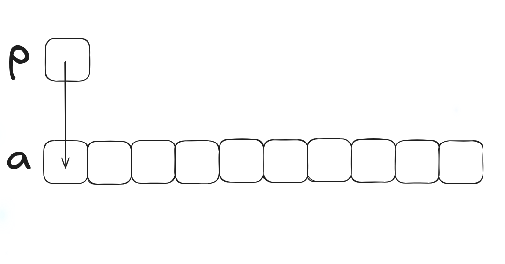
	2. 將數值存入就會變成
		```c
		*p = 5;
		```
		示意圖：<br>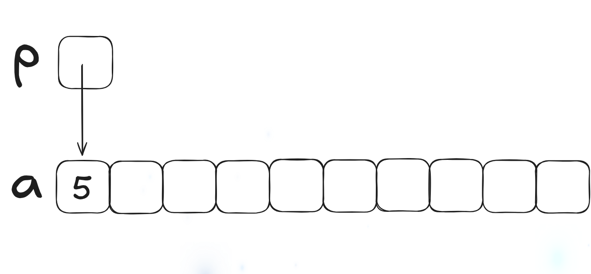
- 除了之前提過的部份，也可以對於 p 執行 pointer arithmetic (or address arithmetic) ，用以**讀取陣列中的其他元素**
- C 所支持的 pointer arithmetic:
	1. Adding an integer to a pointer 
	2. Subtracting an integer from a pointer 
	3. Subtracting one pointer from another
- 以下為接下來會用的變數的宣告
	```c
	int a[10], *p, *q, i;
	```
<br>

#### 二，Adding an Integer to a Pointer

- 如果 p 指向 a\[i]，則 p + j 則會指向 a\[i + j]<br>E.g:
	1. 
		```c
		p = &a[2];
		```
		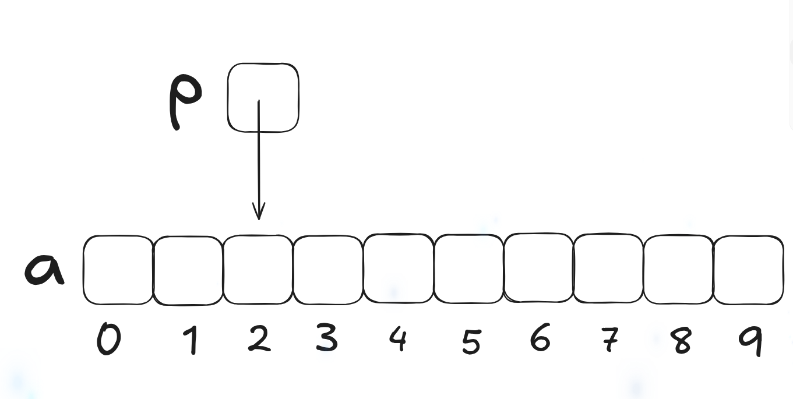
	2. 
		```c
		q = p + 3;
		```
		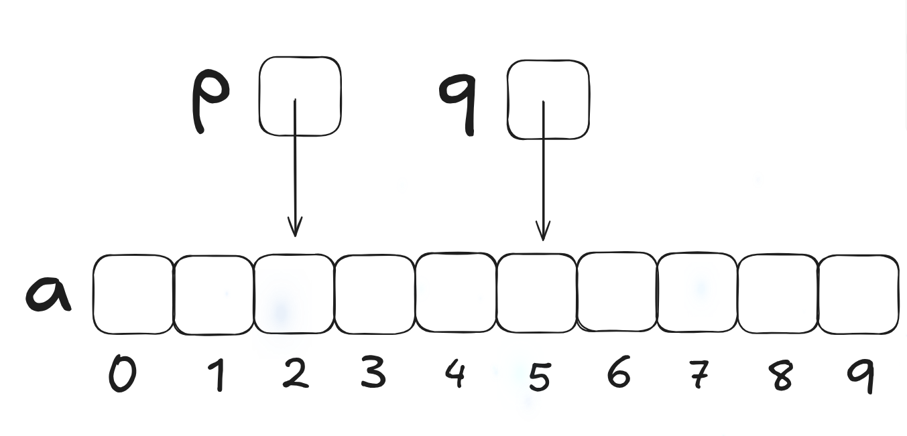
	3. 
		```c
		p += 6;
		```
		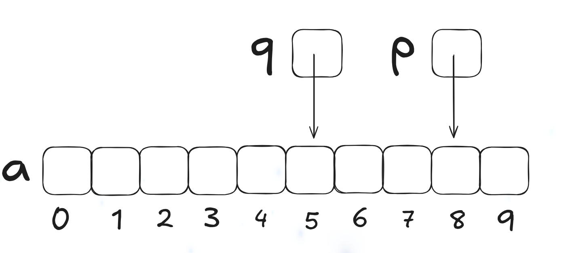
<br>

#### 三，Subtracting an Integer from a Pointer

- 如果 p 指向 a\[i]，則 p - j 就會指向 a\[i - j]<br>E.g:
	1. 
		```c
		p = &a[8];
		```
		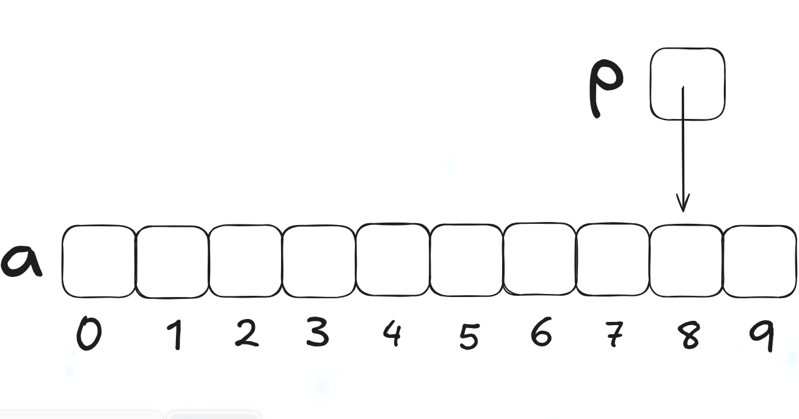
	2. 
		```c
		q = p - 3;
		```
		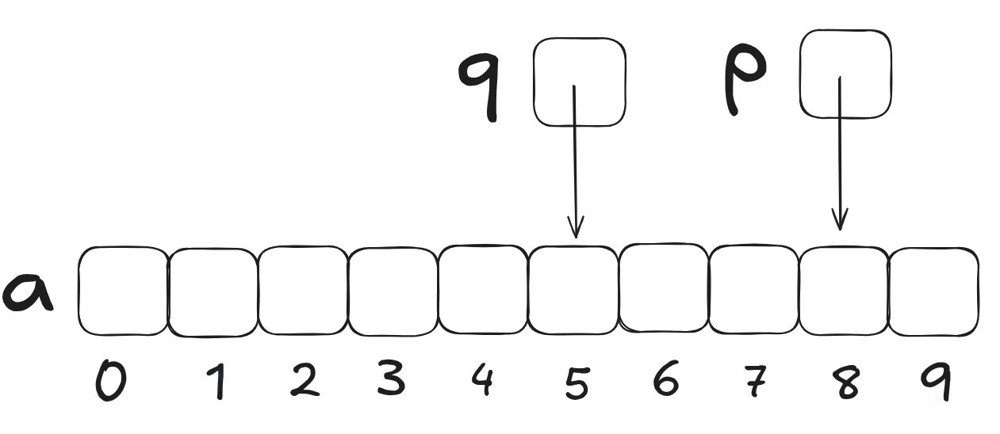
	3. 
		```c
		p -= 6;
		```
		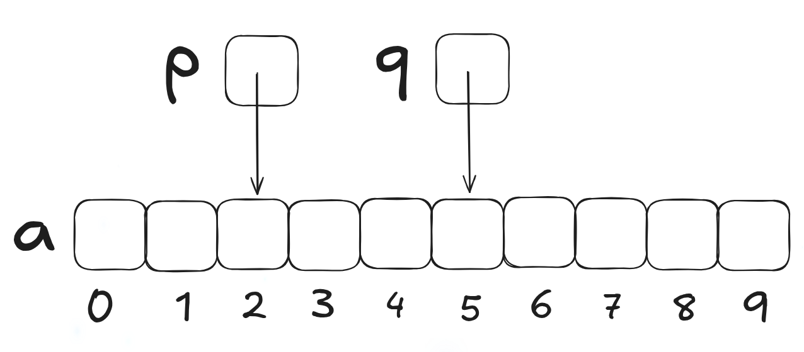
<br>

#### 四，Subtracting One Pointer from Another

- 如果 p 是指向 a\[i] 而 q 是指向 a\[j]，則 p - q 就是指向 i - j<br>E.g:
	1. 
		```c
		p = &a[5];
		q = &a[1];
		
		i = p - q;
		// i is 4
		i = q - p;
		// i is -4;
		```
		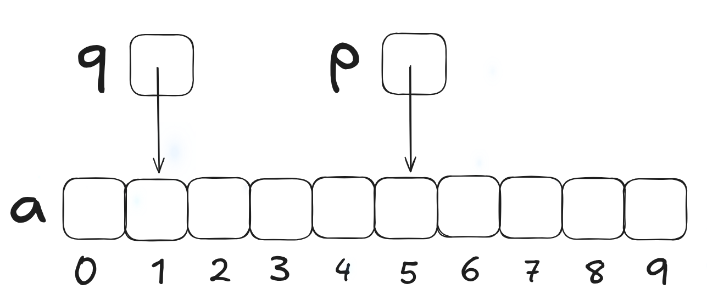
<br>

#### 五，Comparing Pointers

- 也可以將 relational operators (<, <=, >, >=) 與 equality operators (== ,!=) 用在比較指標上<bR>E.g:
	```c
	p = &[5];
	q = &[1];
	```
	`p <= q` 會是 0 ，而 `p >= q` 會是 1
<br>

#### 六，Pointers to Compound Literals

- 在 C99 內，指標也可以作用於 Compound literals 上<br>E.g:
	```d
	int *p = (int []){3, 0, 3, 4, 1}'
	```
	此時 p 會**指向第一個元素 (也就是 a\[0])**，所以上述例子等價於
	```c
	int a[] = {3, 0, 3, 4, 1};
	int *p = &a[0];
	```
<br><Br>

### II. Using Pointers for Array Processing

#### 一，Intro

- Pointer arithmetic 使我們可以利用 increment 來使用陣列內的元素<br>E.g: 加總陣列內的元素
	```c
	#define N 10
	...
	int a[N], sum, *p;
	...
	sum = 0;
	for (p = &a[0]; p < &a[N]; p++)
	  sum += *p;
	```
	- 雖然 a\[N] 並不存在，但在這裡是合法的，因為 for statement 不會企圖去存取 a\[N] (因為是 < 而不是 <=)
	- 示意圖：
		1. 第一次迴圈：<br>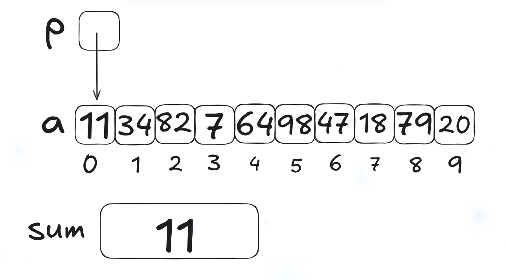
		2. 第二次迴圈<br>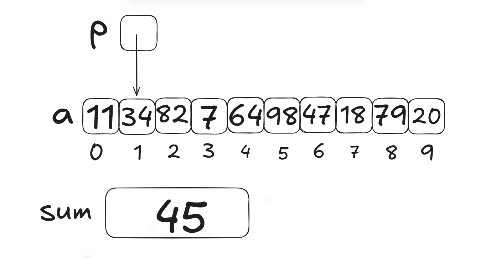
		3. 第三次迴圈<br>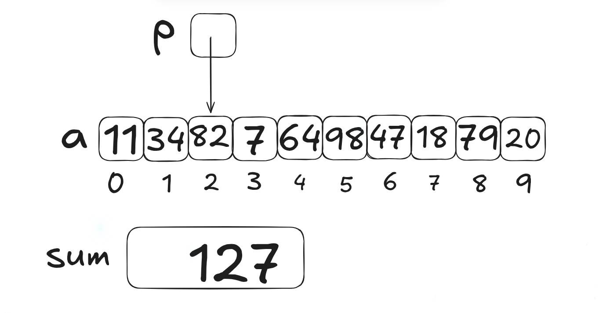
<br>

#### 二，Combining the \* and \++ Operators

- E.g:
	```c
	a[i++] = j;
	```
	等價於
	```c
	*p++ = j
	```
	因為 ++ 的優先度較 \* 高，所以編譯器會將它解讀為
	```c
	*(p++) = j
	```
	會先執行 p++ (因為是 profix 的，所以 ++ 不會立刻執行，用 \* 的時候還是 p)，再執行 \*
- 其他的搭配：

	| Expression         | Meaning                                                          |
	| ------------------ | ---------------------------------------------------------------- |
	| \*p++ or \*(p++)   | Value of expression is \*p before increment; increment p later   |
	| (\*p)++            | Value of expression is \*p before increment; increment \*p later |
	| \*++p or \*(++p)   | Increment p first; value of expression is \*p after increment    |
	| ++(\*p) or ++(\*p) | Increment \*p first; value of expression is \*p after increment  |
	- 其中最常用的為 \*p++，常用於 loop 中<Br>E.g:
		```c
		for (p = &a[0]; p < a[N]; p++)
		  sum += *p
		```
		等價於
		```c
		p = &a[0];
		while (p < a[N])
		  sum += *p++;
		```
<br><br>

### III. Using an Array Name as a Pointer

#### 一，Intro

- 陣列的名字可以直接當作**第一個元素的指標**，**不需要額外宣告**<br>E.g:
	```c
	int a[10];
	*a = 7;       // stores 7 in a[0]
	*(a+1) = 12;  // stores 12 in a[1]
	```
	- a + i 就代表 \&a\[i]，而 \*(a+i) 就代表 a\[i]
- 注意，如果重複宣告陣列名字的話，它就會變成一般的指標<br>E.g:
	```c
	int a[10];
	int *a;
	*a = 0;  
	// WRONG
	// 因為此時的 a 為一般的指標，
	// 而你沒有將這個指標指向其他的物件
	```
- 但陣列名字指標**不可被更新數值**<br>E.g:
	```c
	while (*a != 0)
	  a++;             // WRONG
	```
- 這個特性可以直接應用於迴圈當中，使迴圈容易被寫出來<br>E.g:
	```c
	for (p = &a[0]; p < &a[N]; p++)
	  sum += *p
	```
	等價於
	```c
	for (p = a; p < a + N; p++)
	  sum += *p
	```
<br>

#### 二，範例一：Reversing a Series of Numbers (Revisited)

- 學習重點：
	1. 將原本陣列的迴圈修改為用指標來寫
	2. `scanf` 因為在輸入數字的時候本來就要有指標 (因為有 `&`)，所以輸入的變數換成指標變數的時候，就不需要加上 `&`，直接寫 p
- program:
	```c
	// Reverses a series of numbers
	
	#include <stdio.h>
	#define N 10
	
	int main(void)
	
	{
	    int a[N];
	
	    printf("Enter 10 numbers: ");
	    for (int *p = a; p < a + N; p++)
	      scanf("%d", p);
	
	    printf("In reverse order: ");
	    for (int *p = a + (N - 1); p >= a; p--)
	      printf("%d ", *p);
	    printf("\n");
	
	    return 0;
	}
	```
- output:
	```
	Enter 10 numbers: 1 2 3 4 5 6 7 8 9 10
	In reverse order: 10 9 8 7 6 5 4 3 2 1 
	```
<br>

#### 三，Array Arguments (Revisited)

- 當我們將陣列作為引數時，用的便是將陣列名稱作為引數的技巧，所以在 ch9 的時候說陣列並**不會被複製**，因為用的是**指標**<Br>E.g:
	```c
	int find_largest(int a[], int n) {
	  int i, max;
	  
	  max = a[0];
	  for (i = 1; i < n; i++)
	    if (a[i] > max)
	      max = a[i];
	  return max;
	}
	```
	當我們呼叫 function 之後
	```c
	largest = find_largest(b, N);
	```
	就會產生一個指標，將 b 陣列的第一個元素指向 a。陣列本身並沒有被複製
- 這個技巧也導致了陣列的元素會被 function 所影響，而一般的元素不會（因為一般的變數都是被複製過去的）
- 如果要保護陣列內的元素不被影響，可加上 const<br>E.g:
	```c
	int find_largest(const int a[], n) {
	...
	}
	```
<br>

#### 四，Using a Pointer as an Array Name

- 可以將指標作為陣列的下標來使用<br>E.g:
	```c
	#define N 10
	...
	int a[N], i, sum = 0, *p = a;
	...
	for (i = 0; i < N; i++)
	  sum += p[i]
	```
	c 對待 p\[i] 會等於 \*(p+i)
<br>

### IV. Pointers and Multidimensional Arrays

#### 一， Processing the Elements of a Multidimensional Array

- 在 Ch8 中有提到 c 儲存二維陣列的時候是用 row-major order，也就代表對於 c 而言，多維陣列會長的像以下這樣<br>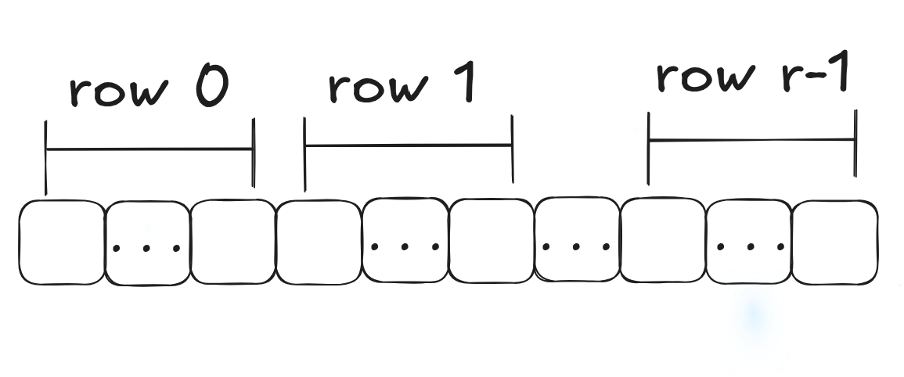
- 所以可以利用這個特性，先**宣告一個指標在指向陣列中 row 0 與 col 0 的位子再遞增**就可以利用全部的元素了<br>E.g:
	```c
	int a[NUM_ROWS][NUM_COLS];
	int row, col;
	
	...
	
	for (row = o; row < NUM_ROWS; row++)
	  for (col = 0; col < NUM_COLS; col++)
	    a[row][col] = 0;
	```
	等價於
	```c
	int *p
	
	...
	
	for (p = &a[0][0]; p < &a[NUM_ROWS][NUM_COLS]; p++)
	  *p = 0;
	```
	- 但這樣換過去其實會讓易讀性降低
<br>

#### 二，Processing the **Rows** of a Multidimensional Array

- 以下為在多維陣列中，如果只要處理一個 row 的其他方法
	1. initialize (觀察 row i)
		```c
		p = &a[i][0];
		```
		等價於
		```c
		p = a[i];
		```
		因為 a\[i] 等價於 \*(a + i)，所以 p = &a\[i]\[0] 等價於 <br>&(\*(a\[i] + 0))  (也就是 **row i 中的第一個元素的真實值**) ，也就等價於 a\[i]
	2. E.g:
		```c
		int a[NUM_ROWS][NUM_COLS], *p, i;
		...
		for (p = a[i]; p < a[i] + NUM_COLS; p++)
		  *p = 0;
		```
		- *備註： `a[i] + NUM_COLS` 為在 a 中 row i 的第一個元素加 column 的數量（也就是 row i 中最後一個元素）*
- 也可以利用這個技巧**只將一個 row 作為引數傳送過去**<br>E.g:
	```c
	largest = find_largest(a[i], NUM_COLS)
	```
<br>

#### 三，Processing the **Columns** of a Multidimensional Array

- E.g:
	```c
	int a[NUM_ROWS][NUM_COLS], (*p)[NUM_COLS], i;
	...
	for (p = &a[0]; p < &a[NUM_ROWS]; p++)
	  (*p)[i] = 0;
	```
	1. `int (*p)[NUM_COLS]` 
		- 宣告一個指向擁有 NUM_COLS 元素個數的陣列。接下來會用於**指向一整個 row**。
		- 換到下一個指向時會一次跳 NUM_COLS (也就是切換到下一個 row) 
		- *注意：() 不可省略，如果省略就會變成指標的陣列，我們現在要的是指向陣列的指標*
	2. `P = &a[0]` 將指標 p 指向 a 的 row 0
	3. `p++` 更新 p 的指向，切換到下一個 row
	4. `(*p)[i] = 0` 因為 p 代表的是一整個 row，所以 (\*p)\[i] 就是指派這一個 row 中的 col i 為 0
<br>

#### 四，Using the Name of a Multidimensional Array as a Pointer

- 以下會用到的變數的宣告
	```c
	int a[NUM_ROWS][NUM_COLS]
	```
- `a` 不是代指 a\[0]\[0]，而是 **a\[0]** (因為 c 將高維陣列視為一維)
- `a[]` 的型別為 `int (*) [NUM_COLS]`，也就是指向**陣列的 row** 
- 用途：
	1. 簡化高維陣列的 loop<br>E.g:
		```c
		for (p = &a[0]; p < &a[NUM_ROWS]; p ++)
		  (*p)[i] = 0;
		```
		等價於
		```c
		for (p = a; p < a + NUM_ROWS; p++)
		  (*p)[i] = 0;
		```
	2. 讓 function 用**一維陣列的形式來處理高維陣列**
		- 這個方法可以使 function **重複利用**，因為如果要宣告 function 要用高維陣列作為引數的話需要將陣列中除了第一維的長度都寫出來，也就是說如果**其他陣列長度或維度不相同就不能用 prototype 的寫法**
		- E.g:
			```c
			largest = find_largest(a, NUM_ROWS * NUM_COLS)
			// WRONG
			```
			因為 a 的型別為 `int (*)[NUM_COLS]` ，但編譯器需要的是 `int *` (因為陣列是作為引數被傳送過去的)，所以需要寫成
			```c
			largest = find_largest(a[0], NUM_ROWS * NUM_COLS)
			```
			`a[0]` 為指向在 row 0 中的元素 0 ，而且型別為 `int *`，接著在 function 內只需要用元素 0 的位置就可以由記憶體的連續性得出全部陣列的位置
<br><br>

## VI. Pointers and Variable-Length Arrays (C99)

- VLA 也理所當然的與 pointer 有關<br>E.g:
	```c
	void f(int n)
	{
	  int a[n], *p;
	  p = a;
	  ...
	}
	```
- 當 VLA 高於一維時，指標必須要包含**除了第一維以外的其他維度**<br>E.g:
	```c
	void f(int m, int n)
	{
	  int a[m][n], (*p)[n];
	  p = a;
	  ...
	}
	```
	- 因為 p 的型別是依賴不為常數的 n ，所以被稱作 **variably modified type**
- **注意**：陣列長度的錯誤不一定會被編譯器給抓出來<br>E.g:
	```c
	int a[m][n], (*p)[m];
	p = a;
	// 雖然編譯器不會報錯，但只有在 
	// m = n 的時候才會跑出正確的結果
	// 其他都是 undefined behavior
	```
- Variably modified type 的限制
	- 一定要**在 function 中或 prototype 被宣告**
- Pointer arithmetic 在 VLA 的運作與一般的陣列相同<br>E.g:
	```c
	int a[m][n], (*p)[n];
	
	for (p = a; p < a + m; p++)
	  (*p)[i] = 0;
	```
<br><Br>

---
# Exercise

## I. Pointer arithemetic

#### EX.1

- 我的答案：
	1. (a) 14
	2. (b) 34
	3. (c) 4
	4. (d) true
	5. (e) false
#### **EX.2**

- 我的答案：
	- 因為指標不能夠被除以及**相加**
- **修正**
	```c
	middle = (high - low) / 2 + low
	```
	- (high - low) 為整數，所以可以被除以 2
<br>

## II. Using an array name as a pointer for array processing

#### EX.3

- 我的答案：
	1. 第一輪迴圈
		- 1 儲存進 temp
		- 因為 \*p++ 等價於 \*(p++)，所以 a\[0] 會先被設定為 10，接著 p 再指向 a\[1]
		- 因為 \*q-- 等價於 \*(q--)，所以 a\[9] 會先被設定為 1，接著 q 再指向為 a\[8]-
		- 由此得知每一輪迴圈會將第 i 個元素與第 N+1-i 個元素對調，也就是陣列的元素會前後對調
	- 最終結果為 a\[N] 的元素依序為 {10, 9, 8, 7, 6, 5, 4, 3, 2, 1}

#### EX.4

- 我的答案：
```c
#include <stdbool.h>
#define STACK_SIZE 100

// external variables
int contents[STACK_SIZE];
int *top_ptr = contents;

void make_empty(void)
{
top_ptr = contents;
} 

bool is_empty(void)
{
return top_ptr == contents;
} 

bool is_full(void)
{
return top_ptr == contents + STACK_SIZE;
}
```
<br>

## III. Using an array name as a pointer

#### **EX.5**

- 我的答案：
	1. **(a)** 因為 p 為 pointer 而 a\[0] 為數值，所以**型別不合，無法比較**
		- 而 (d) 則是用 **p\[i] = \*(p + i)** 
	2. (b) 因為因為 `p == &a[0]` 等價於 `p == a` ，且已經用了 `p = a`，所以必然為真 

#### **EX.6**

- 我的答案：
	```c
	int sum_array(const int a[], int n)
	{
	  int sum;
	  
	  sum = 0;
	  for (const int *p = a; p < a + n; p++)
	    sum += *p;
	  return sum;
	}
	```
- 因為在參數上對 a\[] 用了 `const`，所以必須要在指標的型別前加上 `const`，以確保**指標不會修改陣列的值**，否則編譯器會跳出警告
- 雖然用了 `const`，可是因為是用 `const int *p` 所以可以改變 \*p 的指向，只是不能夠改變值
- 如果用的是 `int * const p` 那就不可以改變指向了


#### EX.7

- 我的答案：
	```c
	bool search(const int a[], int n, int key)
	{
	  for (const int *p = a; p < a + n; p++)
	    if (*p == key)
	      return true;
	  return false;
	}
	```

#### EX.8

- 我的答案
	```c
	void store_zeros(int a[], int n)
	{
	  for (int *p = a; p < a + n; p++)
	    *p = 0;
	}
	```
<br>

#### EX.9

- 我的答案
```c
double inner_product(const double *a, const double *b, 
                     int n)
{
  const double *p, *q; 
  double product_sum = 0;
  
  for (p = a, q = b; p < a + n; p++, q++)
    product_sum += ((*p) * (*q));
    
  return product_sum;
}
```

#### EX.10

- 我的答案
```c
int *find_middle(int a[], int n) {
  return a + n/2;
}
```
<br>

#### EX.11

- 我的答案
```c
int find_largest(int a[], int n) {
  int *p, max;
  
  max = *a;
  for (p = a + 1; p < a + n; p++)
    if (*p > max)
      max = *p;
  return max;
}
```
<br>

#### EX.12

- 我的答案
```c
void find_two_largest(const int *a, int n, int *largest,
                      int *second_largest)
{
  const int *p = a;
  
  if (*p > p[1]) {
    *largest = *p;
    *second_largest = p[1];
  } else {
    *largest = p[1];
    *second_largest = *p;
  }
  
  for (p = a + 2; p < a + n; p++) {
    if (*p > *largest) {
      *second_largest = *largest;
      *largest = *p;
    }
    else if (*p > *second_largest)
      *second_largest = *p;
  }
}
```
<br>

#### **EX.13**

- 我的答案
```c
#define N 10

double ident[N][N], *p;
int i;

for (i = 0, p = ident[0]; p < &ident[N][N]; p++, i++) {
  if (i == 0)
    *p = 1;
  else if (i > N) {
    *p = 1;
    i = 0;
  } else
    *p = 0;
}
```
- 錯誤點：
	1. 因為陣列是從 0 開始的，所以最後一個是 ident\[N-1]\[N-1]
	2. 記得只要宣告為小數，數字就也要填小數
	3. 可以在一開始的時候就將計數器設為 N ，這樣就可以省去一行了
- 修正後的答案：
```c
#define N 10

double ident[N][N], *p;
int non_zero;

for (p = ident[0], non_zero = N; p < ident[0] + N * N; p++, non_zero++) {
  if (i > N) {
    *p = 1;
    non_zero = 0;
  } else
    *p = 0;
}
```
<br>

#### **EX.14**

- 我的答案：
```c
search(temperatures[], 7 * 24, 32);
```
- 錯誤點：
	1. 因為函式要求的是 int \* ，所以要必須要給它一個指向整數的指標，所以必須要用
		```c
		temperatures[0]
		```
- 修正後
```c
search(temperatures[0], 7 * 24, 32);
```
<br>

#### **EX.15**

- 我的答案
```c
for (int *p = temperatures[i]; p < temperatures[i] + 24; p++)
  printf("%d ", *p);
```
- 重點：
	- temperatures\[i]  指的就是 row i 中的第 0 個元素
<br>

#### **EX.16**

- 我的答案
```c
int *day_temp;

for (day_temp = temperatures; day_temp < temperatures +  7; day_temp++) {
  printf("%d ", find_largest(day_temp[0], 24));
}
```
- 錯誤點
	- 如果要指向陣列的行的話，記得要**宣告指標為陣列**

- 修正後
```c
int (*day_temp)[24];

for (day_temp = temperatures; day_temp < temperatures +  7; day_temp++) {
  printf("%d ", find_largest(day_temp[0], 24));
}
```
<br>

#### **EX.17**

- 我的答案
```c
int sum_two_dimensional_array(const int a[][LEN], int n)
{
  int sum = 0, *p;
  
  for (p = a[0]; p < a[0] + n * LEN; p++) {
    sum += *p;
  }
}
```

- 錯誤
	1. a 陣列有 `const`，記得要保留 `const`
	2. 忘記回傳 sum
	3. 因為不能用 \[]，所以必須要用 p\[i] = \*(p + i) 的公式將 a\[0] 換成 \*a
- 修正後
```c
int sum_two_dimensional_array(const int a[][LEN], int n)
{
  int sum = 0;
  const int *p;
  
  for (p = *a; p < *a + n * LEN; p++) {
    sum += *p;
  }

  return sum;
}
```
<br>

#### EX.18

- 我的答案
```c
int evaluate_position(char board[8][8]) {

  int black_sum = 0, white_sum = 0; 
  char *p;
  
  for (p = *board; p < *board + 8 * 8; p++)
    switch (*p) {
      case 'q':
        black_sum += 9;
        break;
      case 'r':
        black_sum += 5;
        break;
      case 'b':  case 'n':
        black_sum += 3;
        break;
      case 'p':
        black_sum += 1;
        break;
      case 'Q':
        white_sum += 9;
        break;
      case 'R':
        white_sum += 5;
        break;
      case 'B':  case 'N':
        white_sum += 3;
        break;
      case 'P':
        white_sum += 1;
        break;
    }

  return white_sum - black_sum;
}
```
<BR><br>

---
# Programming Projects

## Proj.1: 訊息反轉

#### (a) 用變數來指向陣列

>[!success]- program
>```c
> // This is my program for programming project 1 in
> // C Programming: a modern approach
> // This program is used to reverce a message
> 
> #include <stdio.h>
> 
> #define MAX_CHAR 100
> 
> int main(void) {
>   char ch, message[MAX_CHAR];
>   int num_word = 0;
> 
>   printf("Enter a message: ");
> 
>   while ((ch = getchar()) != '\n') {
>     message[num_word] = ch;
>     num_word++;
>   }
> 
>   printf("Reversal is: ");
>   while (num_word >= 0) {
>     printf("%c", message[num_word]);
>     num_word--;
>   }
>   printf("\n");
> 
>   return 0;
> }
>```

>[!success]- output
>```
>$ ./programming-project_Ch12_a 
>Enter a message: Don't get mad, get even
>Reversal is: neve teg ,dam teg t'noD
>```

#### (b) 用指標來指向陣列

>[!success]- program
>```c
> // This is my program for programming project 1 in
> // C Programming: a modern approach
> // This program is used to reverce a message
> 
> #include <stdio.h>
> 
> #define MAX_CHAR 100
> 
> int main(void) {
>   char ch, message[MAX_CHAR], *num_word = message;
> 
>   printf("Enter a message: ");
> 
>   while ((ch = getchar()) != '\n') {
>     *num_word = ch;
>     num_word++;
>   }
> 
>   printf("Reversal is: ");
>   while (num_word >= message) {
>     printf("%c", *num_word);
>     num_word--;
>   }
>   printf("\n");
> 
>   return 0;
> }
>```

>[!success]- output
>```
>$ ./programming-project_Ch12_1b 
>Enter a message: Don't get mad, get even.
>Reversal is: .neve teg ,dam teg t'noD
>```

<br>

#### Proj.2: 判斷是否為 palindrome

#### (a) 用變數來指向陣列

>[!success]- program
>```c
> // This is my program for programming project 2 (a)
> // in C Programming: a modern approach
> // This program is used to checks whether it's a palindrome
> 
> #include <ctype.h>
> #include <stdbool.h>
> #include <stdio.h>
> 
> #define MAX_NUM 100
> 
> // external variable
> char message[MAX_NUM];
> int num_word = 0;
> 
> // prototype
> void read_message(void);
> bool check_palin(void);
> 
> int main(void) {
>   printf("Enter a message: ");
>   read_message();
> 
>   if (check_palin())
>     printf("Palindrome\n");
>   else
>     printf("Not a palindrome\n");
> 
>   return 0;
> }
> 
> void read_message(void) {
>   char ch;
> 
>   while ((ch = getchar()) != '\n') {
>     message[num_word] = toupper(ch);
>     num_word++;
>   }
> }
> 
> bool check_palin(void) {
>   int initial_num_word = 0;
> 
>   while (initial_num_word < num_word) {
>     // 檢查是否是字母
>     if (message[num_word] > 'Z' || message[num_word] < 'A') {
>       num_word--;
>       continue;
>     }
>     if (message[initial_num_word] > 'Z' || message[initial_num_word] < 'A') {
>       initial_num_word++;
>       continue;
>     }
> 
>     // 檢查是否為 palindrome
>     if (message[initial_num_word] == message[num_word]) {
>       initial_num_word++;
>       num_word--;
>       continue;
>     } else {
>       return false;
>     }
>   }
>   return true;
> }
>```

>[!success]- output
>```
>$ ./programming-project_Ch12_2a 
>Enter a message: He lived as a devil, eh?
>Palindrome
>
>$ ./programming-project_Ch12_2a 
>Enter a message: Madam, I am Adam.
>Not a palindrome
>```

#### (b) 用指標來指向陣列

>[!success]- program
>```c
> // This is my program for programming project 2 (a)
> // in C Programming: a modern approach
> // This program is used to checks whether it's a palindrome
> 
> #include <ctype.h>
> #include <stdbool.h>
> #include <stdio.h>
> 
> #define MAX_NUM 100
> 
> // external variable
> char message[MAX_NUM];
> char* num_word = message;
> 
> // prototype
> void read_message(void);
> bool check_palin(void);
> 
> int main(void) {
>   printf("Enter a message: ");
>   read_message();
> 
>   if (check_palin())
>     printf("Palindrome\n");
>   else
>     printf("Not a palindrome\n");
> 
>   return 0;
> }
> 
> void read_message(void) {
>   char ch;
> 
>   while ((ch = getchar()) != '\n') {
>     *num_word = toupper(ch);
>     num_word++;
>   }
> }
> 
> bool check_palin(void) {
>   char* initial_num_word = message;
> 
>   while (initial_num_word < num_word) {
>     // 檢查是否是字母
>     if (*num_word > 'Z' || *num_word < 'A') {
>       num_word--;
>       continue;
>     }
>     if (*initial_num_word > 'Z' || *initial_num_word < 'A') {
>       initial_num_word++;
>       continue;
>     }
> 
>     // 檢查是否為 palindrome
>     if (*initial_num_word == *num_word) {
>       initial_num_word++;
>       num_word--;
>       continue;
>     } else {
>       return false;
>     }
>   }
>   return true;
> }
>```

>[!success]- output
>```
>$ ./programming-project_Ch12_2b 
>Enter a message: He lived as a devil, eh?
>Palindrome
>
>$ ./programming-project_Ch12_2b 
>Enter a message: Madam, I am Adam.
>Not a palindrome
>```

