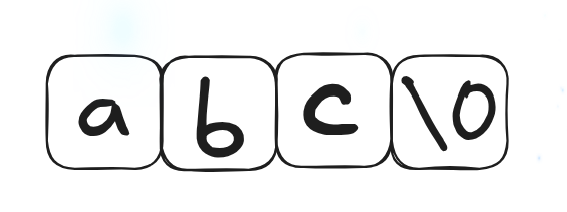
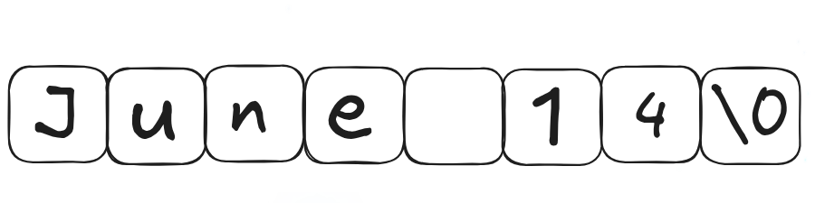
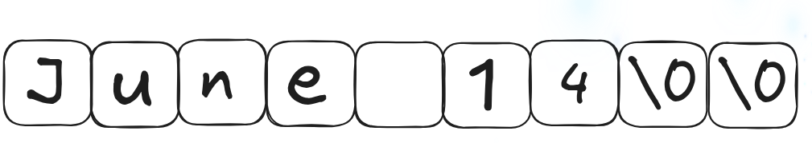
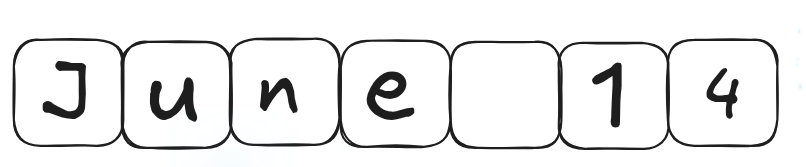

# C program: a modern approach Ch.13 note

## Program overview


| 題號  | 功能                 | 觀念                      | 連結                 |
| --- | ------------------ | ----------------------- | ------------------ |
| 範例一 | 輸入一個月內的事情，並依日期排序輸出 | string.h 中關於 string 的操作 | [view](./remind.c) |

## I. String Literals

#### 一，Intro

- string literals (字串常值)： 被包含在 "" 中的一連串字元<br>E.g:
	```
	"When you come to a fork in the road, take it"
	```

#### 二，Escape Sequences in String Literals

- 在 Ch7 中所出現的 escape sequence 也都可以出現在 string literals 中<br>E.g:
	```
	"Cand\nIs dandy\nBut liquor\nIs quicker.\n --Ogden Nash\n"
	```
	結果會是
	```
	Candy
	Is dandy
	But liquor
	Isquicker.
	 --Ogden Nash
	```
- 雖然也可以用 octal 與 hexadecimal escape ，但並不常見

#### 三，Continuing a String Literal

- 如果覺得 string literal 太長，可以**用 \\ 來換行** (與終端機相同)<br>E.g:
	```c
	printf("When you come to a fork in the road, take it. \
	--YogiBerra");
	```
- 但因為用\\ 的話必須要在 \\ 後就直接接上字元，所以會**破壞縮排**
- 如果不想破壞縮排的話，可以直接用**多個 \""**<br>E.g:
	```c
	printf("When you come to a fork in the road, take it. "
	       "--Yogi Berra");
	```
	- *備註，這樣不會換行，因為沒有換行符*

#### 四，How String Literals Are Stored

- 物理儲存：
	- 當遇到 string literals 的時後， C 會將其作為**陣列來儲存**
	- 而如果長度為 n，則 C 會提供 n + 1 個 byte 的位置，而最後一個位置需要**作為 straing literals 結束的符號**
	- 而結束的符號就是 **null character**，也就是 **'\0'** (與 0 不同， 0 的 ASCII 代號為 48，而 null character 為 0)
- 邏輯使用：
	- 在運用 string literals 時，他是作為**指標來運作**的
	- 他的型別為 `char *` (\* 代表的是**指標**，不是值)
	- 以 `printf("abc");` 為例
		1. C 會先以陣列的形式來儲存 abc<br>示意圖如下<br>
		2. 接著以 "abc" 呼叫出來 (用指標的概念去想)
<br>

#### 五，Operations on String Literals

- 因為 string literal 的型別為 `char *p`，所以照著**指標的邏輯去使用**<br>E.g:
	```c
	char *p;
	
	p = "abc"
	```
	也可以**加入 indexing**
	```c
	char ch;
	
	ch = "abc"[1]
	```
	這樣的話 ch 就是指向字母 b (0 是 a， 1 是 b， 2 是 c)
- 範例，將一般的數字換成 hex digit
```c
char digit_to_hex_char(int digit)
{
  return "0123456789ABCDER"[digit]
}
```
- 注意，**如果調整字會造成 undefined behavior**<br>E.g:
	```C
	char *p = "abc";
	
	*p = 'd';
	// WRONG
	```
<br>

#### 六，String Literals versus Character Constants

- string literals 用 **""** 包起來，而 character constants 用 **''** 包起來
- string literal 代表的是一個**指標**，而 character constants  則是 **integer** (也就是 numerical code 字元碼)
- 注意，這兩者不可混用<br>E.g:
	```c
	printf("\n");
	
	printf('\n');
	// WRONG
	// 因為 printf() 需要的引數為 char *，所以不可以用 ''
	```
<Br>

## II. String Variables

#### 一，Intro

- 任何一個 **char 型別的一維陣列都可以用來儲存 string literal** (但要記得要保留最後一格**加上 \\0**)<br>idiom:
	```c
	#define STR_LEN 80
	...
	char str[STR_LEN+1];
	```
- 雖然陣列長度為 80 + 1 ，但不必然 string literal 長度比然是 80 ，因為 string literal 的**結束是由 null characters 決定** ，不是看陣列長度， 80 僅僅是**最大值**
<br>

#### 二，Initializing a String Variable

- string variable 的 initialize <br>E.g:
	```c
	char date1[8] = "June 14";
	```
	記憶體中的示意圖<br>
- 雖然以上的例子為 string variable，但 c 其實是將其視為陣列初始化的縮寫，也就是等價於
	```c
	char date1[8] = {'J', 'u', 'n', 'e', ' ', '1', '4', '\0'};
	```
- 如果字數太少的話編譯器會**自動增加 null character**<br>E.g:
	```c
	char date2[9] = "June 14";
	```
	示意圖：
- 如果格子數太少的話， **null character 會被丟棄，導致不能被作為 string variable 來使用**<br>E.g:
	```c
	char date3[7] = "June 14";
	```
	示意圖<br>
- 如果陣列沒有指定長度，則編譯器會自動算出 string literal + null character 的長度，讓它可以**剛好放下去** (**長度之後不可被變動**)<Br>E.g:
	```c
	char date4[] = "June 14";
	```
<br>

#### 三，Character Arrays versus Character Pointers

- 在 C 之中
	```c
	char date[] = "June 14";
	```
	與
	```c
	char *date = "June 14";
	```
	雖然皆是**合法**的，但兩者有不同之處
- 不同之處
	1. 在陣列中，裡面的元素**可以被更換**<br>在指標中，因為指向的是 string literal，所以它**無法被更換**
	2. 在陣列中， date 為**陣列的名字**<br>在指標中， date 則為**指標變數**，可以被**更改指向其他的字串**
- 不同的初始化方式
	1. 
		```c
		char *p;
		```
		編譯器先給與 p 一個儲存位址的空間，但並**沒有給予它儲存 string 的空間，所以還不能直接給予 string**
	2. 給予 string 空間的方式<br>E.g:
		```c
		char str[STR_LEN+1], *p;
		
		p = str;
		```
	- 注意：**不可以用沒有給予 string 空間就直接指向 character**<Br>E.g:
		```c
		char *p;
		
		p[0] = 'a';   // WRONG
		p[1] = 'b';   // WRONG
		p[2] = 'c';   // WRONG
		p[3] = '\0';  // WRONG
		```
<br>

## III. Reading and Writing Strings

#### 一，Writing Strings Using `printf` and `puts`

1. `printf()`
	- string 所用的 conversion specification 為 `%s`<br>E.g:
		```c
		char str[] = "Are we having fun yet?"
		
		printf("%s\n", str);
		```
		output:
		```
		Are we having fun yet?
		```
	- `printf` 會一路印出，直到遇到 null character
	- 如果要印出一部份的字串的話，可以加上 `%.ps` (p 為要印出的字數)<br>E.g:
		```c
		printf("%.6s\n", str);
		```
		將會印出
		```
		Are we
		```
	- 在 `%ms` 中的 m 則與 integer 相同，至少要顯示到多少格。- 號為置左， + 號為置右
1. `puts`
	- E.g:
		```c
		puts(str);
		```
		因為 `puts` 只有一個引數，所以它永遠會寫入一個換行符
<br>

#### 二，Reading Strings Using `scanf` and `gets`

1. `scanf()`
	- 讀取字串所用的 conversion specification 為 `%s`<br>E.g:
		```c
		scanf("%s", str);
		```
	- **不需要用 &**，因為 str 被視為 pointer (因為陣列的名稱為第一個元素的指標)
	- 它會自動放置一個 \\0 在後面
	- 但 `scanf()` 會**忽略所有的空白**，且 **\\n, tab, space 皆會會導致它停止輸入**
2. `gets`
	- 與 `scanf` 不同之處
		1. `gets` **不會跳過空白**
		2. **只有遇到 \\n 的時候會停下來**
	- 與 `scanf` 一樣會放置 \\0 在最後面與 \\n 不會被儲存進陣列中<br>E.g: 輸入 To C, or not to C: that is the question.
		1. `scanf`<br>Program:
			```c
			char sentence[SENT_LEN+1];
			
			printf("Enter a sentence:\n");
			scanf("%s", sentence);
			```
			結果：只會讀到 To (因為後面接的是空白鍵)
		2. `gets`<br>將 `scanf` 那行改成
			```c
			gets(sentence);
			```
			結果：會讀到To C, or not to C: that is the question. (也就是全部)
- 注意：`scanf` 與 `gets` 都**不會偵測到陣列是否滿了**，但
	- `scanf` 可以使用 %ns 來限制輸入的大小 (n 為最大輸入值)
	- `gets` 則沒有，所以建議改用 `fgets` (在 ch22.5 會講)
<br>

#### 三，Reading Strings Character by Character

- 因為用 `scanf` 或 `gets` 都有相同的問題，所以可以自己設計一個讀取的 function 來輸入字串
- 需要考量的要點：
	1. 是否要跳過空白
	2. 要用什麼來當做結束的符號
	3. 如果長度超過陣列怎麼辦
- E.g: 不跳過空白鍵，且遇到 \n 的時候結束
	- prototype
		```c
		int read_line(char str[], int n);
		```
		str\[] 是用來讀取字串，而 n 則是最大輸入值 (也就是陣列長度 - 1，保留最後一格給 \\0)
	- program
		```c
		int read_line(char str[], int n)
		{
		  int ch, i = 0;
		  
		  while ((ch = getchar) != '\n')
		    if (i < n)
		      str[i++] = ch;
		  str[i] = '\n';
		  // terminates string
		  return i;
		  // number of characters stored
		}
		```
		注意： ch 的型別為 **`int`，因為要接受 getchar()**，所以必須用 `int`
<br><Br>

## IV. Accessing the Characters in a String

- 因為字串是以陣列的方式來儲存的，所以可以以陣列的方式來使用<br>E.g: 計算在字串內的空白有多少
	1. 一般變數的寫法 
		```c
		int count_space(const char s[])
		{
		  int count = 0;
		  
		  for (int i = 0; s[i] != '\0'; i++)
		    if (s[i] == ' ')
		      count++;
		  return count;
		}
		```
	2. 指標的寫法
		```c
		int count_space(const char *s)
		{
		  int count = 0;
		  
		  while (*s != '\0') {
		    if (*s == ' ')
		      count++;
		    s++;
		  }
		  return count;
		}
		```
<br>

## V. Using the C String Library

#### 一，Intro

- 在一般的狀況下，因為字串的運作原理是陣列，所以**無法使用 operator 來複製與比較**<br>E.g:
	1. 
		```c
		char str1[10], str2[10];
		
		str1 = "abc"; // WRONG
		str2 = str1; // WRONG
		```
		因為在 Ch12.3 中有說過**陣列名稱不可以作為 lvalue**，但下面的 statement 可以
		```c
		char str1[10] = "abc";
		```
		因為這是**初始化**
	2. 
		```c
		if (str1 == str2)... // WRONG
		```
		這個也不行，因為兩者的記憶體恆不相同，所以這個是恆等式
- 接下來會用的 statement，皆是屬於 **<string.h>** 這個標頭檔的
- 在 <string.h> 中的 function 大部分都需要至少一個字串作為引數
- 且 string parameter 皆為 `char *` 的型別
<br>

#### 二，The `strcpy`(string copy) Function

1. strcpy:
	- 在 <string.h> 中的 prototype
		```c
		char *strcpy(char *s1, const char *s2);
		```
	- `strcpy` 會將**字串 s2 複製進字串 s1**，且會回傳 s1，因為 s2 不會被動到，所以增加了一個 `const` 的型別
	- 雖然有回傳值，但其實也可以直接丟棄 (只要是 function 皆可)
	- 用以代替字串無法直接複製進陣列的問題<br>E.g:
		```c
		str2 = "abcd";
		// WRONG
		```
		要改成
		```c
		strcpy(str2, "abcd");
		// str2 now contains "abcd"
		```
		接著可以直接複製進 str1
		```c
		strcpy(str1, str2);
		```
	- 雖然絕大多數的時間都會直接丟棄回傳值，但有時候也可以多加利用<br>E.g:
		```c
		strcpy(str1, strcpy(str2, "abcd"))
		// both str1 and str2 now contain "abcd"
		```
	- 但要小心，strcpy **不會檢查陣列是否塞的進去**
2. strncpy:
	- 有**三個引數**<Br>E.g: 將 str2 複製進 str1
		```c
		strncpy(str1, str2, sizeof(str1))
		```
	- 如果超過 str1 所能容納的範圍，它會**停止在剛好 str1  塞滿的時候**，但**不會有 null character**
	- 更安全的作法
		```c
		strncpy(str1, str2, sizeof(str1) - 1);
		str1[sizeof(str1 - 1)] = '\0'
		```
		這樣最後一格就確保會是 null character
<Br>

#### 三，The `strlen` (String Length) Function

- prototype
	```c
	size_t strlen(const char *s);
	```
	- `size_t` 為  `typedef` 名字，代表 **unsigned integer types**
- `strlen` 會**回傳字串 s 的長度** (從開頭到 null character，但不包含到 null character)，**不是陣列的長度**
- E.g:
	```c
	int len;
	
	len = strlen("abc");  // len is now 3
	len = strlen("");     // len is now 0
	strcpy(str1, "abc");
	len = strlen(str1);   // len is now 3
	```
<br>

#### 四，The `strcat` (String Concatenation) Function

1. strcat
	- prototype
		```c
		char *strcat(char *s1, const char *s2);
		```
	- `strcat` 會將**字串 s2 複製進字串 s1 的後面**
	- **回傳 s1** (也就是結果字串的指標)
	- E.g:
		1. 不使用回傳值
			```c
			strcpy(str1, "abc");
			strcat(str1, "def");    // str1 now contains "abcdef"
			strcpy(str1, "abc");
			strcpy(str2, "def");
			strcat(str1, str2);    // str1 now contains "abcdef"
			```
		2. 使用回傳值
			```c
			strcpy(str1, "abc");
			strcpy(str2, "def");
			strcat(str1, strcat(str2, "ghi"));
			  // str1 now contains "abcdefghi";
			  // str2 contains "defghi"
			```
	- 注意：**如果 str1 的大小不夠將字串 str2 放入，會產生 undefined behavior**
2. strncat
	- 與 strncpy 一樣，都是**較為安全的版本**
	- 有**三個引數**
	- E.g:
		```c
		strncat(str1, str2, sizeof(str1) - strlen(str1) - 1);
		```
		- *注，最後一個的用意引數為：總空間 sizeof(str1) 減去已用去的時間 strlen(str1) 最後再減掉 null character 所需的空間*
<br>

#### 五，The `strcmp` (String Comparison) Function

- prototype
	```c
	int stcmp(const char *s1, const char *s2);
	```
- 回傳值
	- s1 **<** s2: 回傳值**小於 0**
	- s1 **\==** s2: 回傳值**等於 0**
	- s1 **>** s2: 回傳值**大於 0**
- E.g:
	1. 
		```c
		if (strcmp(str1, str2) < 0)
		// 如果 str1 小於 str2
		  ...
		```
	2. 
		```c
		if (strcmp(str1, str2) <= 0)
		// 如果 str1 小於或等於 str2
		  ...
		```
- 比較大小的邏輯
	- 依據 lexicographic ordering (字典序) 來比較大小
	- 由左置右來比大小<br>E.g:
		1. "abc" 與 "bcd"
			- 因為 a 比 b 小，所以 "abc" 比 "bcd" 還小，其他的根本不會被比較
		2. "abd" 與 "abe"
			- 理由同上，因為 d 比 e 小 (前兩個相等)，所以 "abd" 比 "abe" 小
	- 長度較小的就比較小<br>E.g:
		- "abc" 與 "abcd"
			- 因為前兩項相等，且 "abc" 比較短，所以 "abc" 小於 "abcd" (可以想成已經遇到 null character，所以後面的字母必定比較大)
	- 依據 ASCII 的編碼比較
		- 由大到小編碼順序為 **A-Z, a-z, 0-9**
<br>

#### 六，範例一：Printing a One-Month Reminder List

###### 第一版：讀取一行的字串

>[!success]- program
>```c
> // Prints a one-month reminder list
> 
> #include <stdio.h>
> #include <string.h>
> 
> #define MAX_WORD 50
> #define MAX_DAY 15
> 
> // prototype
> void read_line(char str[], int n);
> 
> int main(void) {
>   char str[MAX_DAY][MAX_WORD], temp_str[MAX_WORD];
> 
>   printf("Enter day and reminder: ");
>   read_line(temp_str, MAX_WORD);
> 
>   printf("%s\n", temp_str);
> }
> 
> void read_line(char str[], int n) {
>   int ch;
>   char* p;
> 
>   for (p = str; (ch = getchar()) != '\n'; p++)
>     if (p < str + n - 1)
>       *p = ch;
>     else
>       break;
>   p[1] = '\0';
> }
>```

>[!success]- output
>```
>$ ./remind 
>Enter day and reminder: 24 Susan's birthday
>24 Susan's birthday
>```

###### 第二版：讀取多行的字串，並排列順序

- 問題點：
	1. 如果要儲存陣列的 row 的指標的話，要宣告一維陣列的指標
	2. 一維陣列的指標要記得加上 ()
	3. \* 的意思是回到宣告的東西上，也就是說如果在宣告時用的就是陣列名，加上 \* 並不是變成值，而是變為陣列的名稱 (也就是**前面所宣告的陣列中第一個元素的位址**)

>[!bug]- program
>```c
> // Prints a one-month reminder list
> 
> #include <stdio.h>
> #include <string.h>
> 
> #define MAX_WORD 50
> #define MAX_DAY 15
> 
> // prototype
> int read_line(void);
> void store_str(char* last_reminder_row);
> void print_str(char* last_reminder_row);
> 
> // external variable
> char str[MAX_DAY][MAX_WORD], temp_str[MAX_WORD];
> 
> int main(void) {
>   char* last_reminder_row = str;
> 
>   for (;;) {
>     printf("Enter day and reminder: ");
>     if (!read_line()) {
>       break;
>     }
>     last_reminder_row++;
>     store_str(last_reminder_row);
>   }
> 
>   print_str(last_reminder_row);
> 
>   return 0;
> }
> 
> int read_line(void) {
>   int ch;
>   char* p;
> 
>   // 檢查第一個字元是否為 0
>   if ((ch = getchar()) == '0') {
>     return 1;
>   } else {
>     str[0] = ch;
>   }
> 
>   // 輸入第二個以後的字元
>   for (p = str + 1; (ch = getchar()) != '\n'; p++)
>     if (p < str + MAX_WORD - 1)
>       *p = ch;
>     else
>       break;
>   p[1] = '\0';
> 
>   return 0;
> }
> 
> void store_str(char* last_reminder_row) {
>   char *row_position = str, *move_row;
> 
>   // 找出 temp_str 所適合的位置
>   while (strcmp(temp_str, row_position) < 0) {
>     row_position++;
>   }
> 
>   // 從最後的 reminder (也就是 row) 開始移動
>   // 空出空間給新的字串
>   for (move_row = last_reminder_row; row_position <= move_row; move_row--) {
>     strcpy(move_row + 1, move_row);
>   }
> 
>   // 新的字串放入正確的位子中
>   strcpy(row_position, temp_str);
> }
> 
> void print_str(char* last_reminder_row) {
>   for (char* p = str; p <= last_reminder_row; p++) {
>     printf("%s", *p);
>   }
> }
>```

>[!failure]- 編譯器的報錯
>```
>$ gcc -o remind remind.c 
>remind.c: In function ‘main’:
>remind.c:18:29: warning: initialization of ‘char *’ from incompatible pointer type ‘char (*)[50]’ [-Wincompatible-pointer-types]
>   18 |   char* last_reminder_row = str;
>      |                             ^~~
>remind.c: In function ‘read_line’:
>remind.c:42:12: error: assignment to expression with array type
>   42 |     str[0] = ch;
>      |            ^
>remind.c:46:10: warning: assignment to ‘char *’ from incompatible pointer type ‘char (*)[50]’ [-Wincompatible-pointer-types]
>   46 |   for (p = str + 1; (ch = getchar()) != '\n'; p++)
>      |          ^
>remind.c:47:11: warning: comparison of distinct pointer types lacks a cast
>   47 |     if (p < str + MAX_WORD - 1)
>      |           ^
>remind.c: In function ‘store_str’:
>remind.c:57:24: warning: initialization of ‘char *’ from incompatible pointer type ‘char (*)[50]’ [-Wincompatible-pointer-types]
>   57 |   char *row_position = str, *move_row;
>      |                        ^~~
>remind.c: In function ‘print_str’:
>remind.c:75:18: warning: initialization of ‘char *’ from incompatible pointer type ‘char (*)[50]’ [-Wincompatible-pointer-types]
>   75 |   for (char* p = str; p <= last_reminder_row; p++) {
>      |                  ^~~
>```

- 問題點：
	- 因為 `strcmp` 是以字典排序來比較大小的，所以會造成 12 比 5 小
	- 因此必須要用 scanf 來強制讓它變成 05

>[!bug]- 修改後的 program
>```c
> // Prints a one-month reminder list
> 
> #include <stdio.h>
> #include <string.h>
> 
> #define MAX_WORD 50
> #define MAX_DAY 15
> 
> // prototype
> int read_line(void);
> void store_str(char (*last_reminder_row)[MAX_WORD]);
> void print_str(char (*last_reminder_row)[MAX_WORD]);
> 
> // external variable
> char str[MAX_DAY][MAX_WORD], temp_str[MAX_WORD];
> 
> int main(void) {
>   // 修正點：要存入一整個 row 的話，就必須要宣告一個
>   // 一維陣列的指標
>   char (*last_reminder_row)[MAX_WORD] = str;
> 
>   for (;;) {
>     printf("Enter day and reminder: ");
>     if (read_line() == 1) {
>       break;
>     }
>     store_str(last_reminder_row);
>     last_reminder_row++;
>   }
> 
>   print_str(last_reminder_row);
> 
>   return 0;
> }
> 
> int read_line(void) {
>   int ch;
>   char* p;
> 
>   // 檢查第一個字元是否為 0
>   if ((ch = getchar()) == '0') {
>     return 1;
>   } else {
>     temp_str[0] = ch;
>   }
> 
>   // 輸入第二個以後的字元
>   for (p = temp_str + 1; (ch = getchar()) != '\n'; p++)
>     if (p < temp_str + MAX_WORD - 1)
>       *p = ch;
>     else
>       break;
>   *p = '\0';
> 
>   return 0;
> }
> 
> void store_str(char (*last_reminder_row)[MAX_WORD]) {
>   // 修正點：
>   char (*row_position)[MAX_WORD] = str, (*move_row)[MAX_WORD];
> 
>   // 找出 temp_str 所適合的位置
>   while (strcmp(temp_str, *row_position) < 0 &&
>          row_position < last_reminder_row) {
>     row_position++;
>   }
> 
>   // 從最後的 reminder (也就是 row) 開始移動
>   // 空出空間給新的字串
>   for (move_row = last_reminder_row; row_position <= move_row; move_row--) {
>     strcpy(move_row[1], *move_row);
>   }
> 
>   // 新的字串放入正確的位子中
>   // 修正點：因為之前指派 row_position 為 str
>   // 所以當用上 * 的時候會變成 str (也就是陣列的位址)
>   strcpy(*row_position, temp_str);
> }
> 
> void print_str(char (*last_reminder_row)[MAX_WORD]) {
>   printf("\n");
>   for (char (*p)[MAX_WORD] = str; p <= last_reminder_row; p++) {
>     printf("%s\n", *p);
>   }
> }
>```

>[!failure]- output
>```
>Enter day and reminder: 24 Susan's birthday
>Enter day and reminder: 5 6:00 - Dinner with Marge and Russ
>Enter day and reminder: 26 Movie - "Chinatown"
>Enter day and reminder: 7 10:30 - Dental appointment
>Enter day and reminder: 12 Movie - "Dazed and Confused"
>Enter day and reminder: 5 Saturday class
>Enter day and reminder: 12 Saturday class
>Enter day and reminder: 0
>
>7 10:30 - Dental appointment
>5 Saturday class
>5 6:00 - Dinner with Marge and Russ
>26 Movie - "Chinatown"
>24 Susan's birthday
>12 Saturday class
>12 Movie - "Dazed and Confused"
>```