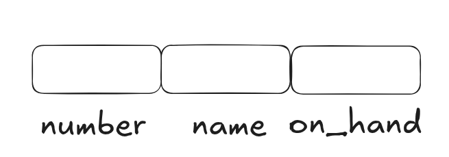
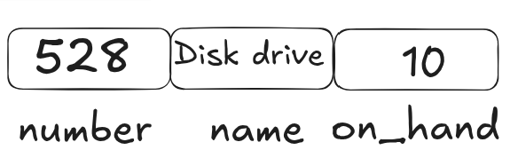

# C program: a modern approach Ch.16 note

# Program overview


| 題號  | 功能           | 觀念                        | 連結                          |
| --- | ------------ | ------------------------- | --------------------------- |
| 範例一 | 貨物的 database | 學習使用 structure，並將其與陣列組合使用 | [view](./inventory_program) |
<br><Br>

---
## I. Structure Variables

#### 一，Intro

- 目前學過的 data structure 只有陣列，而 structure 也屬於 data structure 的一種
- structure 中的元素稱為 **members**
- structure 與陣列的不同之處
	1. members **不必然有著相同的型別**
	2. 要呼叫 members 必須要用**名稱**而非位址
<Br>

#### 二，Declaring Structure Variables

- 假設我們需要兩個變數 (part1 與 part2)，且每個變數皆需要有 number, name, 與 on_hand 這三個數值，就可以宣告成
	```c
	struct {
	  int number;
	  char name[NAME_LEN+1];
	  int on_hand;
	} part1, part2;
	```
	- **變數名稱填在最後面**
	- 在記憶體中會儲存成<br>
- 且每一個 member 內部所需要的變數名稱不會與其他的 structure **內部**的變數名稱衝突<Br>E.g:
	```c
	struct {
	  int number;
	  char name[NAME_LEN+1];
	  int on_hand;
	} part1, part2;
	
	struct {
	  int name[NAME_LEN+1];
	  int number;
	  char sex;
	} emplouee1, employee2;
	```
	雖然兩個 structure 中都有 number 與 name 但不會影響彼此
<Br>

#### 三，Initializing Structure Variables

- 要初始化 sturcture 的話因為有一連串的內部變數，所以需要用 **{}** 來初始化<Br>E.g:
	```c
	struct {
	  int number;
	  char name[NAME_LEN+1];
	  int on_hand;
	} part1 = {528, "Disk drive", 10},
	  part2 = {914, "Printer cable", 5};
	```
	 記憶體示意圖<br>
- 在初始化的規則基本上都與陣列類似，例如：沒有被初始化到的值皆為 0
<Br>

#### 四，Designated Initializers

- 在 structure 也有與陣列相同的 designated initializers - E.g:
	```c
	{528, "Disk drive", 10}
	```
	等價於
	```c
	{.number = 528, .name = "Disk drive", .on_hand = 10}
	```
	- 其中的 . + member 名稱就是 **designator**
	- 因為是以 member 的名稱來作區別的，所以**順序調換並不會有任何的影響**。也就是說上面的初始化等價於
		```c
		{.on_hand = 10, .number = 528, .name = "Disk drive"}
		```
		- *注：在不用 designator 的狀況順序是有差的*
- 與陣列的 designator 相同，並不是所有的東西都需要用進 list 中<br>E.g:
	```c
	{.number = 528, "Disk drive", .on_hand = 10}
	```
<Br>

#### 五，Operations on Structues

- 要取用 member ，必須要用 **structure 名稱** + **.** + **member 的名稱**<br>E.g:
	```c
	printf("Part number: %d\n", part1.number);
	printf("Part name: %s\n", part1.name);
	printf("Quantity on hand: %d\n", part1.on_hand);
	```
- member 因為是 Dlvalue ，所以就照之前的變數去用即可<br>E.g:
	1. 
		```c
		part1.number = 258;
		// changes part1's part number
		part1.on_hand++;
		// increments part1's quaantity on hand
		```
	2. 
		```c
		scanf("%d\n", &part1.on_hand);
		```
		- *注：. 也算式一個 operator，但也因為 . 的 precedence 高於 & ，所以會照著預期的形式來走*
- 也可以**對 structure 使用 assignment**<br>E.g:
	```c
	part2 = part1;
	```
	- 意思就是將 part1 裡面的資訊都複製給 part2
	- 因為陣列不可被用 = 複製 (在此指的是**複製整條陣列，單一元素可以**)，所以可以利用 structure 的特性來讓他們可以被複製<br>E.g:
		```c
		struct {int a[10]; } a1, a2;
		
		a1 = a2;
		// 因為 a1 與 a2 都是 structure 所以合法
		```
- 只有擁有 compatible type 可以被使用 assignment 來複製
- 而要有 compatible 的狀態就必須要**同時被宣告**
- 缺點：未來**無法被新增新的 structure**，就算重新宣告一次也會因為 compatible 的限制而**無法被複製**
<br><br>

## II. Structure Types

#### 一，Declaring a Structure Tag

- **structure tag**: 用來辨認 structure 種類的名稱<br>E.g:
	```c
	struct part {
	  int number;
	  char name[NAME_LEN+1];
	  int on_hand;
	};
	```
	-  其中的 part 就是 structure tag
	- 記得 } 之後要加**分號**
- 使用了 structure tag 之後，就可以**用來宣告變數**<br>E.g:
	```c
	struct part part1, part2;
	```
- 就算使用了 structure tag ，也還是可以**同時宣告變數**<br>E.g:
	```c
	struct part {
	  int number;
	  char name[NAME_LEN+1];
	  int on_hand;
	} part1, part2;
	```
- 就算是分開用 structure tag，也是有 compatible 的特性<br>E.g:
	```c
	struct part part1 = {528, "Disk drive", 10};
	struct part part2;
	
	part2 = part1;
	// legal; both parts have the same type
	```
<Br>

#### 二，Defining a Structure Type

- 也可以使用 typedef 來作為替代<br>E.g:
	```c
	typedef struct {
	  int number;
	  char name[NAME_LEN+1];
	  int on_hand;
	} Part;
	```
	- 注意：structure tage 在用 typedef 的時候是必須在**最後面**的
- 宣告：
	```c
	Part part1, part2
	```
	- 這裡**不可以有 struct**
<br>

#### 三，Structures as Arguments and Return Values

- 用了 structures tag 之後就可以將 strcture 用做引數<br>E.g:  part 為 structures tag
	1. 將 structure 做為引數
		- 定義 function
			```c
			void print_part(struct part p)
			{
			  printf("Part number: %d\n", p.number);
			  printf("Part name: %s\n", p.name);
			  printf("Quantity on hand: %d\n", p.on_hand);
			}
			```
		- 呼叫 function
			```c
			print_part(part1);
			```
	2. 回傳 structures
		- 定義 function
			```c
			sturct part build_part(int number, const char *name,
			                       int on_hand)
			{
			  struct part p;
			  
			  p.number = number;
			  strcpy(p.name, name);
			  p.on_hand = on_hand;
			  return p;
			}
			```
		- 呼叫 function
			```c
			part1 = build_part(528, "Disk drive", 10);
			```
- 也可以**在 function 中初始化**<br>E.g:
	```c
	void f(struct part part1)
	{
	  struct part part2 = part1;
	}
	```
	- 裡面的 part2 為 local variable
<Br>

#### 四，Compound Literals

- structure 也可以結合 compound literal 來使用
- 使用方式
	1. **結合參數來作傳遞用途**
		```c
		print_part((struct part) {528, "Disk drive", 10});
		```
	2. **指派變數**
		```c
		part1 = (struct part) {528, "Disk drive", 10};
		```
	3. 在傳遞的時候來做初始化
		```c
		print_part((struct part) {.on_hand = 10,
		                          .name = "Disk drive",
		                          .number = 528});
		```
<br>

## III. Nested Arrays and Structures

#### 一, Nested Structures

- 可以**將 structures 放在 structures 中**<Br>E.g:
	```c
	struct person_name {
	  char first[FITST_NAME_LEN+1];
	  char middle_initial;
	  char last[LAST_NAME_LEN+1];
	};
	// 先寫出 structure tag 為 person_name
	// 的 structure
	
	struct student {
	  struct person_name name;
	  int id, age;
	  char sex;
	}  student1, studen2;
	// 接著將 person_name 在名為 student 的
	// structure 中定義
	```
- 如果要使用的話就要加上**多個 .**，有點像是從終端機 cd 進去的感覺<br>E.g:
	```c
	strcpy(studen1.name.first, "Fred");
	```
- 將 structure 放進去 structure 中的好處
	- 可以直接將整塊內部的 structure 拿去用<br>E.g:
		1. 將內部的 structure 做為引數
			```c
			display_name(student1.name);
			```
		2. 直接複製內部的 structure
			```c
			struct person_name new_name;
			...
			strudent1.name = new_name;
			```
<br>

#### 二，Array of Structures

- **陣列的元素為 structrue**<br>E.g:
	```c
	struct part inventory[100];
	```
- 使用：
	- 因為是陣列，所以在取用時需要 subscripting<Br>E.g:
		```c
		print_part(inventory[i]);
		```
	- 如果要使用裡面的 structure 中的 member 的話，需要加上 .<br>E.g:
		```c
		inventory[i].number = 883;
		```
	- 如果是 character 的話會因為要定位，所以需要再額外一個 subscripting <br>E.g:
		```c
		inventory[i].name[0] = '\0';
		```
<Br>

#### 三，Initializing an Array of Structures

- 會用到初始化陣列中的 structure 的時候通常是要**作為 database 的時候**
- 在初始化的時候陣列的**每一個元素都需要一個 {}**
- E.g:
	- structure 的宣告
		```c
		struct dialing_code {
		  char *country;
		  int code;
		};
		```
		- 注：因為這裡是作為對照的編碼，所以未來不會改變，因此才使用指標指向字串
	- 初始化：
		```c
		const struct dialing_code countru_codes[] =
		{ {"Argentina",            54}, {"Bangladesh",     880},
		  {"Brazil",               55}, {"Burma (Myanmar)", 95},
		  {"China",                86}, {"Colombia",        57},
		  {"Congo, Dem. Rep. of", 243}, {"Egypt",           20}, 
		  {"Ethiopia",            251}, {"France",          33}, 
		  {"Germany",              49}, {"India",           91}, 
		  {"Indonesia",            62}, {"Iran",            98},
		  {"Italy",                39}, {"Japan",           81},
		  {"Mexico",               52}, {"Nigeria",        234}, 
		  {"Pakistan",             92}, {"Philippines",     63}, 
		  {"Poland",               48}, {"Russia",           7}, 
		  {"South Africa",         27}, {"South Korea",     82}, 
		  {"Spain",                34}, {"Sudan",          249},
		  {"Thailand",             66}, {"Turkey",          90}, 
		  {"Ukraine",             380}, {"United Kingdom",  44},
		  {"United States",         1}, {"Vietnam",         84} };
		```
	- 使用 sedignator 初始化
		```c
		struct part inventory[100] =
		  {[0].number = 528, [0].on_hand = 10, [0].name = '\0'};
		```
		- 第一個 \[0] 代指陣列索引值為 0 的元素
<Br>

#### 四，範例一：Maintaining a Parts Database

- 這次因時間不足而選擇用範例中的 program 來學習
- 學習重點：
	1. 在全域變數中的變數無須初始化，宣告時及完成初始化 (全為 0)
	2. makefile
		1. makefile 中的指令前面記得要用 tab
		2. makefile 中的第一行為要做的最終目標，將 .o 連結成最後的結果
		3. 其他行就是將每個 .o 檔分開編譯，並將其連結起來
		4. clean 的作用是用來清除檔案

>[!success]- inventoru.c
>```c
> // Maintains a parts database (array version)
> 
> #include <stdio.h>
> 
> #include "readline.h"
> 
> #define NAME_LEN 25
> #define MAX_PARTS 100
> 
> struct part {
>   int number;
>   char name[NAME_LEN + 1];
>   int on_hand;
> } inventory[MAX_PARTS];
> 
> // number of parts currently stored
> int num_parts = 0;
> 
> int find_part(int number);
> void insert(void);
> void search(void);
> void update(void);
> void print(void);
> 
> // main: Prompts the user to enter an operation code,
> //       then calls a function to perform the requested
> //       action. Repeats until the user enters the
> //       command 'q'. Prints an error message if the user
> //       enter an illegal code.
> int main(void) {
>   char code;
> 
>   for (;;) {
>     printf(
>         "operation code:"
>         "i (insert), s (search), u (update), p (print), q (quit)\n");
>     printf("Enter operation code: ");
>     scanf(" %c", &code);
>     // skips to end of line
>     while (getchar() != '\n');
>     switch (code) {
>       case 'i':
>         insert();
>         break;
>       case 's':
>         search();
>         break;
>       case 'u':
>         update();
>         break;
>       case 'p':
>         print();
>         break;
>       case 'q':
>         return 0;
>       default:
>         printf("Illegal code\n");
>     }
>     printf("\n");
>   }
> }
> 
> // find_part: Looks up a part number in the inventory
> //            array. Returns the array index if the part
> //            number is found; otherwise, returns -1.
> int find_part(int number) {
>   for (int i = 0; i < num_parts; i++)
>     if (inventory[i].number == number) return i;
>   return -1;
> }
> 
> // insert: Prompts the user for information about a new
> //         part and then inserts the part into the
> //         database. Prints an error message and returns
> //         prematurely if the part already exists or the
> //         database if full.
> void insert(void) {
>   int part_number;
> 
>   // 輸入檢查
>   if (num_parts == MAX_PARTS) {
>     printf("Database is full; can't add more parts.\n");
>     return;
>   }
> 
>   printf("Enter part number: ");
>   scanf("%d", &part_number);
> 
>   if (find_part(part_number) >= 0) {
>     printf("Part already exists.\n");
>     return;
>   }
> 
>   inventory[num_parts].number = part_number;
>   printf("Enter part name: ");
>   read_line(inventory[num_parts].name, NAME_LEN);
>   printf("Enter quantity on hand: ");
>   scanf("%d", &inventory[num_parts].on_hand);
>   num_parts++;
> }
> 
> // search: Prompts the user to enter a part number, then
> //         looks up the part in the database. If the part
> //         exists, prints the name and quantity on hand;
> //         if not, prints an error message.
> void search(void) {
>   int i, number;
> 
>   printf("Enter part number: ");
>   scanf("%d", &number);
>   i = find_part(number);
>   if (i >= 0) {
>     printf("Part name: %s\n", inventory[i].name);
>     printf("Quantity on hand: %d\n", inventory[i].on_hand);
>   } else
>     printf("Part not found.\n");
> }
> 
> // update: Prompts the user to enter a part number.
> //         Prints an error message if the part doesn't
> //         exist; otherwise, prompts the user to enter
> //         change in quantity on hand and updates the
> //         database.
> void update(void) {
>   int i, number, change;
> 
>   printf("Enter part number: ");
>   scanf("%d", &number);
>   i = find_part(number);
>   if (i >= 0) {
>     printf("Enter change in quantity on hand: ");
>     scanf("%d", &change);
>     inventory[i].on_hand += change;
>   } else
>     printf("Part not found.\n");
> }
> 
> // print: Prints a listing of all parts in the database,
> //        showing the part number, part name, and
> //        quantity on hand. Parts are printed in the
> //        order in which they were entered into the
> //        database.
> void print(void) {
>   printf("Part Number    Part Name                Quantity on Hand\n");
>   for (int i = 0; i < num_parts; i++) {
>     printf("%8d       %-25s%11d\n", inventory[i].number, inventory[i].name,
>            inventory[i].on_hand);
>   }
> }
>```

>[!success]- readline.c
>```c
> #include <ctype.h>
> #include <stdio.h>
> #include "readline.h"
> 
> int read_line(char str[], int n) {
>     int ch, i = 0;
> 
>     // 在讀取之前先清除掉多餘的空白鍵, 換行 , tab 等
>     // 也順便讀取字
>     while (isspace(ch = getchar())) ;
> 
>     while (ch != '\n' && ch != EOF) {
>         if (i < n)
>           str[i++] = ch;
>         // 讀取下一個 character
>         ch = getchar();
>     } 
>     str[i] = '\0';
>     return i;
> }
>```

>[!success]- readline.h
>```c
> // 如果 READLINE_H 被使用過了，就會直接跳到 #endif，
> // 結束這個 readline
> #ifndef READLINE_H
> #define READLINE_H
> 
> // read_line: Skips leading white-space characters, then
> //            reads the remainder of the input line and 
> //            stores it in str. Truncates the line if its
> //            length exceeds n. Returns the number of
> //            characters stored.
> int read_line(char str[], int n);
> 
> #endif
>```

>[!success]- makefile
>```c
>inventory: inventory.o readline.o
>	gcc -o inventory inventory.o readline.o
>
>inventory.o: inventory.c readline.h
>	gcc -c inventory.c
>
>readline.o: readline.c readline.h
>	gcc -c readline.c
>
>clean:
>	rm -f inventory inventory.o readline.o
>
>```

>[!success]- output
>```
> $ ./inventory 
> operation code:i (insert), s (search), u (update), p (print), q (quit)
> Enter operation code: i
> Enter part number: 528
> Enter part name: Disk drive
> Enter quantity on hand: 10
> 
> operation code:i (insert), s (search), u (update), p (print), q (quit)
> Enter operation code: s
> Enter part number: 528
> Part name: Disk drive
> Quantity on hand: 10
> 
> operation code:i (insert), s (search), u (update), p (print), q (quit)
> Enter operation code: s
> Enter part number: 914
> Part not found.
> 
> operation code:i (insert), s (search), u (update), p (print), q (quit)
> Enter operation code: i
> Enter part number: 914
> Enter part name: Printer cable
> Enter quantity on hand: 5
> 
> operation code:i (insert), s (search), u (update), p (print), q (quit)
> Enter operation code: u
> Enter part number: 528
> Enter change in quantity on hand: +2
> 
> operation code:i (insert), s (search), u (update), p (print), q (quit)
> Enter operation code: s
> Enter part number: 528
> Part name: Disk drive
> Quantity on hand: 12
> 
> operation code:i (insert), s (search), u (update), p (print), q (quit)
> Enter operation code: p
> Part Number    Part Name                Quantity on Hand
>      528       Disk drive                        12
>      914       Printer cable                      5
> 
> operation code:i (insert), s (search), u (update), p (print), q (quit)
> Enter operation code: q
>```

