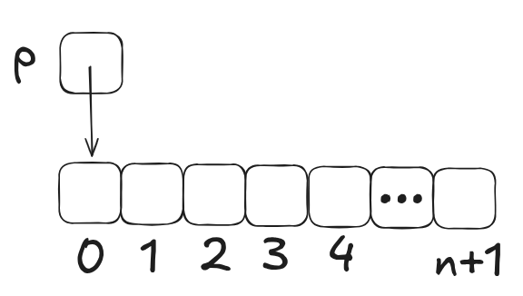
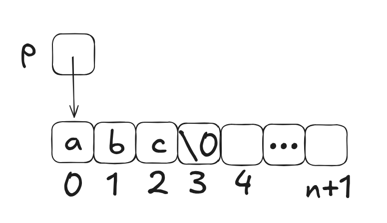

# Note

## I. Dynamic Storage Allocation

#### 一，Intro

- dynamic storage allocation (動態儲存分配): 允許在程式執行期間來自行分配儲存空間
- 可以借用動態的空間分配來自由的讓 data sturucture 變大或變小
<br>

#### 二，Memory Allocation Functions

- 在 <stdlib.h> 中的三個 allocation functions
	1. `malloc`: 分配一塊的記憶體但不初始化它
	2. `calloc`: 分配一塊的**乾淨的**記憶體
	3. `realloc`: 重新分配先前分配過的記憶體的大小
- 在使用後皆會回傳 `void *` 型別的值 (也就是**指標**)，用來標注**記憶體的位址**
<Br>

#### 三，Null Pointers

- 使用 memory allocation function 時，有可能會因為一些原因導致它無法分配給我們，此時就會回傳 **Null pointer**
- null pointer 的 macro 為 **NULL**
- null pointer 的意思就是**指向一個沒有任何東西的地方**
- 注意：不可使用 null pointer 的位址，會產生 undefined behavior
- E.g:
	```c
	p = malloc(10000);
	if (p == NULL) {
	  // allocation failed; take appropriate action
	}
	```
	或
	```c
	if ((p = malloc(10000)) == NULL) {
	  // allocation failed; take appropriate action
	}
	```
- **除了 null pointer 以外**，對於 c 而言**其他的指標皆為 ture**<br>E.g:
	```c
	if (p == NULL)
	```
	等價於
	```c
	if (!p)
	```
<Br><Br>

## II. Dynamically Allocated Strings

#### 一，Using `malloc` to Allocate Memory for a String

- `malloc` 的 prototype
	```c
	void *malloc(size_t size);
	```
	- 要注意型別為 size_t ，為 **unsigned integer**
- 分配空間給**字串**<Br>E.g:
	```c
	p = malloc(n + 1);
	```
	- *注：記得要保留空間給 null character*
	- 如果 p 為 **`char *` 型別**，那 malloc 的回傳值會直接被設定為相同的型別，也就是說，**不需要再用 casting**。也就是說等價於
		```c
		p = (char *) malloc(n + 1);
		```
- 使用這種動態分配的話會造出 n + 1 個**陣列**來儲存此字串，也就是說在使用的時候會與 character array 相同<br>E.g:
	1. 還沒初始化，只有分配空間時
		```c
		char *p = malloc(n + 1);
		```
		示意圖：<br>
	2. 初始化後：
		```c
		stry(p, "abc");
		// 因為 string literal 本來就是位址
		// 所以不需要加 &
		```
		示意圖：<Br>
