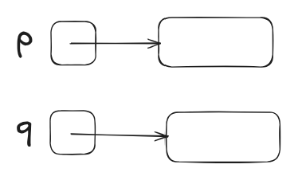
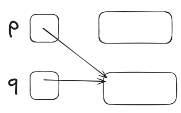

# C program: a modern approach Ch.16 note

## Program overview

| 題號  | 功能                 | 觀念                    | 連結                        |
| --- | ------------------ | --------------------- | ------------------------- |
| 範例一 | 輸入一個月內的事情，並依日期排序輸出 | 將二維陣列改為一維，並且使用動態分配來儲存 | [view](./remind2_program) |
<br><Br>

---
## Note

### I. Dynamic Storage Allocation

#### 一，Intro

- dynamic storage allocation (動態儲存分配): 允許在程式執行期間來自行分配儲存空間
- 可以借用動態的空間分配來自由的讓 data sturucture 變大或變小
<br>

#### 二，Memory Allocation Functions

- 在 <stdlib.h> 中的三個 allocation functions
	1. `malloc`: 分配一塊的記憶體但不初始化它
	2. `calloc`: 分配一塊的**乾淨的**記憶體
	3. `realloc`: 重新分配先前分配過的記憶體的大小
- 在使用後皆會回傳 `void *` 型別的值 (也就是**指標**)，用來標注**記憶體的位址**
<Br>

#### 三，Null Pointers

- 使用 memory allocation function 時，有可能會因為一些原因導致它無法分配給我們，此時就會回傳 **Null pointer**
- null pointer 的 macro 為 **NULL**
- null pointer 的意思就是**指向一個沒有任何東西的地方**
- 注意：不可使用 null pointer 的位址，會產生 undefined behavior
- E.g:
	```c
	p = malloc(10000);
	if (p == NULL) {
	  // allocation failed; take appropriate action
	}
	```
	或
	```c
	if ((p = malloc(10000)) == NULL) {
	  // allocation failed; take appropriate action
	}
	```
- **除了 null pointer 以外**，對於 c 而言**其他的指標皆為 ture**<br>E.g:
	```c
	if (p == NULL)
	```
	等價於
	```c
	if (!p)
	```
<Br><Br>

### II. Dynamically Allocated Strings

#### 一，Using `malloc` to Allocate Memory for a String

- `malloc` 的 prototype
	```c
	void *malloc(size_t size);
	```
	- 要注意型別為 size_t ，為 **unsigned integer**
- 分配空間給**字串**<Br>E.g:
	```c
	p = malloc(n + 1);
	```
	- *注：記得要保留空間給 null character*
	- 如果 p 為 **`char *` 型別**，那 malloc 的回傳值會直接被設定為相同的型別，也就是說，**不需要再用 casting**。也就是說等價於
		```c
		p = (char *) malloc(n + 1);
		```
- 使用這種動態分配的話會造出 n + 1 個**陣列**來儲存此字串，也就是說在使用的時候會與 character array 相同<br>E.g:
	1. 還沒初始化，只有分配空間時
		```c
		char *p = malloc(n + 1);
		```
		示意圖：<br>
	2. 初始化後：
		```c
		stry(p, "abc");
		// 因為 string literal 本來就是位址
		// 所以不需要加 &
		```
		示意圖：<Br>
<br>

#### 二，Using Dynamic Storage Allocation in String Functions

- 假設要做一個會將兩個字串合併成一個的 function (s1 在前， s2 在後，但這兩個的內容物都不能被動到)<br>E.g:
	- 定義
		```c
		char *concat(const char *s1, const char *s2)
		{
		  char *result;
		  // 字串是以位址的方式存在
		  
		  result = malloc(strlen(s1) + strlen(s2) + 1)
		  // 本行的意思是給予 result 可以儲存字串的空間
		  // 因為 malloc 的後面要填的是 size
		  // 所以必須要用 strlen 來確認並給予大小
		  if (result == NULL) {
		    printf("Error: malloc failed in concat\n");
		    exit(EXIT_FAILURE);
		  }
		  strcpy(result, s1);
		  strcat(result, s2);
		  return result;
		}
		```
	- 呼叫
		```c
		p = concat("abc", "def")
		```
<br>

#### 三，範例一： Printing a One-Month Reminder List (Revisited)

- 因為我在 ch13 中的 program 是大量依賴二維陣列的，所以非常難改
- 因此這一次我一樣是從範例的 program 中學
- 學習重點
	- 
		```c
		for (j = num_remind; j > i; j--)
		reminders[j] = reminders[j-1];
		```
		- 功能：用來將字串移到更後面的位址
		- 如果是在第一個字串時，會因無法滿足 for loop 的條件而導致不會跑這個迴圈
		- 可以想成他是直接在**記憶體上操作**，而 reminders 本身是**夾子**
		- 因為 j - 1 本身是已經有被填入字串的，所以使用 reminders\[j] = reminders\[j-1] 其實是在用 已經初始化過的 j - 1 初始化 j，所以並不會有任何的錯誤

>[!success]- program
>```c
> // Prints a one-month reminder list (dynamic string version)
> 
> #include <stdio.h>
> #include <stdlib.h>
> #include <string.h>
> 
> #define MAX_REMIND 50  // maximum number of reminders
> #define MSG_LEN 60     // max length of reminder message
> 
> int read_line(char str[], int n);
> 
> int main(void) {
>   char* reminders[MAX_REMIND];
>   char day_str[3], msg_str[MSG_LEN + 1];
>   int day, i, j, num_remind = 0;
> 
>   for (;;) {
>     // 功能：判斷是否超過能儲存的總數
>     // 不同點：這裡的判斷方式是以計數的形式來判斷，
>     //         而我的則是以二維陣列中下一個空白的
>     //         row 是否超出二維陣列來判斷。
>     if (num_remind == MAX_REMIND) {
>       printf("-- No space left --\n");
>       break;
>     }
> 
>     // 功能：格式化輸入數字，並判斷是否為零
>     printf("Enter day and reminder: ");
>     scanf("%2d", day);
>     if (day == 0) break;
>     // 將格式化後的 day 放入 day_str 中
>     sprintf(day_str, "%2d", day);
>     read_line(msg_str, MSG_LEN);
> 
>     // 找尋適合 day_str 的位址
>     // 並將其儲存進 i
>     for (i = 0; i < num_remind; i++) {
>       if (strcmp(day_str, reminders[i] < 0)) break;
>     }
>     // 移動騰出空間給 j
>     // 如果是第一格字串的話，根本就不會被移動
>     for (j = num_remind; j > i; j--)
>       reminder[j] = reminders[j-1];
> 
>     // 分配空間給 reminders 好讓它可以儲存字串
>     reminders[i] = malloc(2 + strlen(msg_str) + 1);
>     if (reminders[i] == NULL) {
>       printf("--No space left --\n");
>       break;
>     }
> 
>     strcpy(reminder[i], day_str);
>     strcat(reminders[i], msg_str);
>   }
> }
> 
> int read_line(char str[], int n) {
>   int ch, i = 0;
> 
>   while ((ch = getchar()) != '\n') {
>     if (i < n) {
>       str[i++] = ch;
>     }
>     str[i] = 0;
>     return i;
>   }
> }
>```

<br>

### III. Dynamically Allocated Arrays

#### 一，Using `malloc` to Allocate Storage for na Array

- 因為在陣列當中，不一定是一個字就一個 byte ，所以必須要用 `sizeof()` 才能寫出大小
- E.g: 宣告有 n 個元素的陣列
	```c
	int *a;
	// 先宣告為指標
	a = malloc(n * sizeof(int));
	// 留空間給陣列
	for (i = 0; i < i; i++)
	  a[i];
	// 接著就可以像往常使用陣列一樣使用了
	```
<br>

#### 二，The `calloc` Function

- prototype
	```c
	void *calloc(size_t nmemb, size_t size);
	```
	- nmemb 為 number of member 的縮寫，也就是**陣列的數量**
	- size 則為**單一**個 member 的大小
- 與 `malloc` 不同之處：
	- 使用時會順便**初始化**，將全部都設定為 **0**
	- 且會將該記憶體區塊**清空**
- 相同之處：
	- 分配失敗時會回傳 null pointer
- E.g:
	1. 用於陣列
		```c
		a = calloc(n, sizeof(int));
		```
	2. 用於其他的物件
		```c
		struct point { int x, y; } *p;
		
		p = calloc(1, sizeof(struct point));
		```
		- 將 nmemb 設為 1 就可以用來給其他的物件了
<br>

#### 三，The `realloc` Function

- 用途：重新設定變數的**大小**
- prototype
	```c
	void *realloc(void *ptr, size_t size);
	```
	- `*ptr` 為記憶體區塊的**位址**
	- size 則是要修改的大小
- 注意：要使用 realloc 的話，這塊空間必定是要被使用 **malloc, calloc, 或 realloc 切出來的**
- 使用限制
	1. 當在擴充區塊大小時，realloc **無法初始化新增的區塊**
	2. 如果無法更改大小時，會回傳 null pointer，且原區塊**不變**
	3. 如果第一個引數 (也就是記憶體區塊的位址) 為 **null pointer** 時，其行為會變成與 `malloc` **相同**
	4. 如果第二個引數為 0 時，就會將該區塊回歸成**沒被使用的狀態**
<br>

### IV. Deallocating Storage

#### 一，Intro

- 當使用 memory allocation function 時都會從 **heap** 的儲存庫當中使用
- 所以如果**使用太多就會導致沒有位置可用**，而回傳 null pointer
- 且因為是手動分配位置，所以可能會有浪費空間的狀況<br>E.g:
	- program
		```c
		p = malloc(...);
		q = malloc(...);
		p = q;
		```
	- 記憶體示意圖：
		1. 將 p 與 q 做第一次指派時<br>
		2. 執行 `p = q` 後<br>
			- 此時原本分配給 p 的空間就沒有被浪費了
			- 而沒有被指派到的空間就稱為 **garbage**
			- **留存有 garbage** 的 program 就稱為 **memory leak (記憶體洩漏)**
<br>

#### 二，The `free` Function

- prototype
	```c
	void free(void *ptr);
	```
	- `*ptr` 要清除的記憶體位址
- 用途：**清理分配好的空間**，也就是讓那些空間自由
- E.g:
	```c
	p = malloc(...);
	q = malloc(...);
	free(p);
	// 將 p 所指向的記憶體空間清除
	p = q;
	```
<br>

#### 三，The "Dangling Pointer" Problem

- 如果在 p **被清除空間後還想指派**，就會產生 "Dangling pointer" problem
- E.g:
```c
char *p = malloc(4);
...
free(p);
...
strcpy(p, "abc"); 
// WRONG
// 此時的 p 沒有空間可以儲存字串
```
<br>

### V. Linked Lists

#### 一，Intro

- linked list **由一連串的 node (節點) 所組成**，且每一個節點中的最後一格皆為指向下一個 node 的指標<Br>示意圖：<br>
- **最後一格必須要為 null pointer**
- linked list 的用途與 structure, array 很像，都是用來儲存資料的
<br>

#### 二，Declaring a Node Type

- **建造 node**
	- 以 **structure** 來建造 node<br>E.g:
		```c
		struct node {
		  int value;
		  // 用來儲存 data
		  struct node *next;
		  // 用來指向下一個節點
		};
		```
		- 注意：指向下一個 node 的型別為 `struct node *`，即**以當前的 structure 作為模板來作為下一個的節點**，且在前一個是以**位址**的狀態來紀錄下一個 node
- 除了 node 以外，還需要一個指標指向起始點，基本上都會用 **first** 這個名字<br>E.g:
	```c
	struct node *first = NULL;
	```
	- NULL 在此代表的是**空的清單**，也就是還沒有指向任何節點